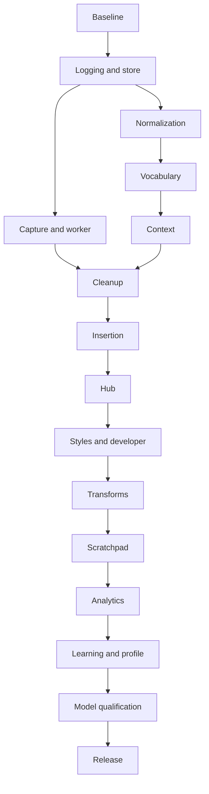

# LocalFlow V2 — Milestones & Coding-Agent Handoff Plan

**Document:** `LOCALFLOW_V2_MILESTONES.md`  
**Version:** 1.1 · 21 September 2026  
**Execution model:** One bounded milestone per fresh strong coding-agent session.  
**Canonical companions:** `LOCALFLOW_V2_SPEC.md` defines behavior; `LOCALFLOW_V2_IMPLEMENTATION_AND_EVALUATION.md` defines proof. This document defines execution, not a competing product architecture.

**Amendment:** v1.1 retains M01–M16 and adds early Training Evidence, ASR hints and optional comparator qualification. Collection starts M02; observed outcome capture starts M08, before M14 curation. Training weights remain post-V2.

## Navigation

- [P01. Scope, baseline and sequencing rationale](#p01)
- [P02. Dependency and work sequence](#p02)
- [P03. Persistent context without conversation replay](#p03)
- [P04. Session permissions and stop policy](#p04)
- [P05. Milestone definitions](#p05)
- [Milestone 1 — Reconcile the deployed baseline and freeze evaluation](#m01)
- [Milestone 2 — Dated observability, persistent jobs and lossless import](#m02)
- [Milestone 3 — Resilient capture and restartable inference](#m03)
- [Milestone 4 — Typed numeric and spoken-syntax normalization](#m04)
- [Milestone 5 — Scoped vocabulary and dictionary management](#m05)
- [Milestone 6 — Local context snapshots and destination awareness](#m06)
- [Milestone 7 — Faithful cleanup and document-aware formatting](#m07)
- [Milestone 8 — Safe insertion, clipboard transactions and recovery undo](#m08)
- [Milestone 9 — Native Hub, searchable history and diagnostics](#m09)
- [Milestone 10 — Styles, snippets and developer workflows](#m10)
- [Milestone 11 — Transforms and requirement-preserving Prompt Engineer](#m11)
- [Milestone 12 — Scratchpad and local writing versions](#m12)
- [Milestone 13 — Accurate local analytics and usage insights](#m13)
- [Milestone 14 — Correction learning and Your Voice profile](#m14)
- [Milestone 15 — Model qualification and end-to-end performance](#m15)
- [Milestone 16 — Integration, offline packaging and V2 acceptance](#m16)
- [P06. Copyable fresh-session kickoff](#p06)
- [P07. Scope and consistency audit](#p07)
- [Evidence references](#evidence-references)

<a id="p01"></a>
## P01. Scope, baseline and sequencing rationale

There are **16 milestones**, aligned to architectural boundaries rather than arbitrary amounts of UI work. The source audited here is `scalinity/LocalFlow` at `7cdd90486b23a1a86b3da00f9fdee39bfa40a8f9`. Future sessions must inspect the current branch and installed configuration rather than assume that snapshot is still current.

The attached analytics database and dictionary/transform definitions exist even though their producing modules were not visible in the audited tree. The first session reconciles this before changes. The logs contain three Metal inference failures and demonstrated cleanup deletions, while cleanup takes approximately 78% of recorded inference duration across 477 timed pairs. That evidence motivates early recovery, normalization and faithful editing rather than an immediate wholesale ASR/model/UI rewrite. No reference WER or Mac performance benchmark was produced during this specification audit.

Preserve current Parakeet and Qwen4B as controls. Dated logging and existing analytics preservation are explicit early deliverables, not tasks saved for final polish. Every milestone must leave the project in a coherent, testable state. Build only the active milestone; do not dispatch its successor automatically.

<a id="p02"></a>
## P02. Dependency and work sequence

| Milestone | Capability | Prerequisites |
|---|---|---|
| M01 | Reconcile the deployed baseline and freeze evaluation | None |
| M02 | Dated observability, persistent jobs and lossless import | M01 |
| M03 | Resilient capture and restartable inference | M02 |
| M04 | Typed numeric and spoken-syntax normalization | M02 |
| M05 | Scoped vocabulary and dictionary management | M02, M04 |
| M06 | Local context snapshots and destination awareness | M02, M05 |
| M07 | Faithful cleanup and document-aware formatting | M03, M04, M05, M06 |
| M08 | Safe insertion, clipboard transactions and recovery undo | M02, M06, M07 |
| M09 | Native Hub, searchable history and diagnostics | M02, M03, M08 |
| M10 | Styles, snippets and developer workflows | M04, M05, M06, M08, M09 |
| M11 | Transforms and requirement-preserving Prompt Engineer | M07, M08, M09, M10 |
| M12 | Scratchpad and local writing versions | M09, M11 |
| M13 | Accurate local analytics and usage insights | M02, M09, M10, M11, M12 |
| M14 | Correction learning and Your Voice profile | M05, M09, M11, M13 |
| M15 | Model qualification and end-to-end performance | M03, M07, M08, M11, M13, M14 |
| M16 | Integration, offline packaging and V2 acceptance | M01, M02, M03, M04, M05, M06, M07, M08, M09, M10, M11, M12, M13, M14, M15 |

Default execution is numerical order, one session at a time. M04 can be developed alongside M03 after M02 because its pure interfaces do not require live model execution; Other parallel work requires revising the dependency table explicitly and using separate worktrees with stable storage contracts. This is optional, not a requirement to maximize concurrency. A coordinator must own shared-schema/contract changes; two sessions must not edit the same database migration or shared UI shell independently.



The dependency table is authoritative; the diagram shows the principal sequence rather than every transitive dependency. A module with a future owner may receive a stable interface now, but it must not become a half-implemented speculative feature.

<a id="p03"></a>
## P03. Persistent context without conversation replay

Use this local repository structure:

```text
docs/v2/
  LOCALFLOW_V2_SPEC.md
  LOCALFLOW_V2_IMPLEMENTATION_AND_EVALUATION.md
  LOCALFLOW_V2_MILESTONES.md
  STATUS.json
  START_HERE.md
  contracts/INDEX.md
  contracts/{jobs,events,artifacts,targets,metrics}.md
  contracts/{asr_hints,training_evidence,references,preferences,dataset_exports}.md
  decisions/ADR-*.md
  handoffs/M01.md ... M16.md
  benchmarks/<run-id>/manifest.json
  acceptance/<milestone-id>/results.json
  baseline/manifest.json
```

The three supplied documents are canonical. Supporting files are created by the milestone that owns them. `START_HERE.md` is a compact orientation index, not a fourth competing specification. Keep raw private logs/audio/database snapshots outside Git; repository reports use opaque IDs, aggregate results and sanitized fixtures.

Bootstrap exception: M01 creates missing status/contract/handoff scaffolding; it must not stop because those future artifacts do not yet exist. `README.md` is the package entry point. Preserve historical JSON/CSV evidence separately from live benchmark reports. Include no private training payloads in commits.

### Fresh-session startup protocol

1. Read the package `README.md` and, once M01 creates them, `START_HERE.md` and `STATUS.json`; then read Spec S01/S05/S06 and the selected milestone only. Read its specifically listed spec/evaluation sections; do not reflexively ingest the entire repository or all historical transcripts.
2. Read the contract index and contracts used by this milestone, its prerequisite handoffs, and relevant accepted ADRs. The immediately preceding numerical milestone is not necessarily its only dependency.
3. Confirm branch/worktree, base commit, local modifications and installed-source differences. Preserve unrelated work; do not reset or clean a working tree to make it look tidy.
4. Inspect the listed source modules and their current callers. Run baseline tests for the owning interfaces. Record pre-existing failures separately.
5. Write a short milestone execution checklist with requirement/suite IDs and intended files. Implement only the approved scope.
6. Run required tests/benchmarks, record commands, environment, dates, exit codes and result paths. Never substitute a mock result for a native or model benchmark.
7. Complete all automatable work. For human-only checks, generate reproducible steps and mark them pending. Do not idle indefinitely and do not mark them passed.
8. Review the diff for scope, regressions, private data leakage and contract changes. Update canonical documents only for an explicit accepted design deviation; add a concise ADR where necessary.
9. Write the milestone handoff, update status/contract indexes and provide the next milestone's kickoff prompt with exact prerequisites. Stop at the milestone boundary. Do not start a successor in the same session merely because tokens remain.

### Status and completion semantics

Allowed states: `not_started`, `in_progress`, `blocked_external`, `implemented_pending_human`, `verified_complete`. Each has owner, branch/worktree, base/current commit, requirement IDs, result paths, pending checks and blockers. A pending human check blocks a dependent milestone only when that check establishes a required interface or permission; otherwise record the dependency risk and continue in a new session. Release cannot be verified complete while required human checks remain.

```json
{
  "schema_version": 1,
  "active_milestone": "M07",
  "status": "implemented_pending_human",
  "source_commit": "actual-commit-sha",
  "requirements": ["LF-R10", "LF-R11", "LF-R28"],
  "automated_results": ["acceptance/M07/results.json"],
  "pending_human": ["long-prompt-list-and-correction-trial"],
  "handoff": "handoffs/M07.md",
  "next_milestone": "M08"
}
```

All values are written from actual work. A future commit is not invented, and a dirty tree is recorded honestly. When an agent cannot finish a milestone within its usable context, it stops at a coherent checkpoint, records completed/remaining tasks and starts no new scope. The next fresh session resumes that same milestone instead of repeating discovery.

### Completion report required from every agent

Each handoff includes: scope and requirement IDs; final branch/base/current commit; actual files changed; decisions/contracts; commands and tests with results; benchmark environment and measurements; acceptance item status; human checks pending/completed; known limitations; unresolved issues; deviations from the spec; rollback instructions; private-data handling; and notes plus a kickoff prompt for the next milestone. Reports distinguish implementation, automated verification, native verification and user approval.

A useful report is usually 600–1,000 words plus linked structured test output. Do not copy full logs, whole code files or all prior handoffs into it. If an interface changed, put the new contract in `contracts/` and cite it from the handoff. The next session reads current contracts, not archaeology.

<a id="p04"></a>
## P04. Session permissions and stop policy

This specification is not blanket authority to modify arbitrary system software, delete files, publish a repository, send messages or purchase/download services. Coding sessions may execute the build/test work the user authorizes for the project. Native permissions and destructive data operations remain explicit. Installation commands operate in the project-managed environment and never replace unrelated global Python packages silently.

Completion of the assigned scope is the normal stop point. External blockers are missing required access, unavailable hardware/permissions, an incompatible external dependency or an unresolved decision that changes the architecture materially. A failing test is normally implementation work to fix, not a reason to ask the user to lower the bar. Human verification being pending is not permission to abandon the remaining automatable work.

When a condition is genuinely impossible in the current environment, document the evidence and finish all independent tasks. Do not claim a missing native API or inaccessible editor was tested. Never silently change a requirement so the milestone can be called done.

<a id="p05"></a>
## P05. Milestone definitions

<a id="m01"></a>
## Milestone 1 — Reconcile the deployed baseline and freeze evaluation

**ID:** M01 · **Requirements:** LF-R01, LF-R28

### Objective

Every later session can identify what is actually running, which existing features/data must survive, and how to evaluate a change.

### Why this milestone exists

The uploaded analytics, dictionary and transforms are real, but their integration is not in the audited Git tree. Building from the earlier “missing” assumption risks erasing working features.

### Required reading

Canonical Spec S01–S05, S23; Evaluation E01–E04, E08. Read P03/P04, the contract index and the handoffs for no prerequisite milestones. Source reading is limited initially to the areas listed below; expand by actual call dependencies.

Also read Spec S29–S31 at contract level and Evaluation E18–E20; freeze inputs/splits and source boundaries without consuming the entire future implementation detail.

### Preconditions

No prior implementation milestone has delivered its required contracts. Review pending human checks for dependency relevance. Baseline failures and local changes are recorded before modifying code.

### In scope

Installed/local/Git provenance inventory; consistent read-only data snapshots; evaluation fixture/report scaffolding; initial contract and handoff ledger.

### Out of scope

Production pipeline changes, model replacement, redesigned Hub, destructive configuration cleanup.

### Architecture contract

Baseline manifest includes Git commit or dirty-tree digest, installed bundle revision, effective config path, both loaded model IDs, runtime versions, data locations and source status. Missing facts are null with reason, not guessed.

### Likely files/modules affected

Existing: README.md, config.json, localflow/config.py, app.py, cleanup.py, stt.py, scripts/build_app.sh, tests/test_cleanup.py, tests/test_stuck_overlay.py. New: docs/v2/baseline/, docs/v2/contracts/, tests/v2/, scripts/v2/. Paths for new code are proposed; adapt to a newer verified source layout without breaking contracts.

### Implementation tasks

1. Inspect the installed app and local working tree without overwriting them; locate the producing code for stats.db/dictionary.json/transforms.json where available.
2. Snapshot the live database consistently and inventory any WAL/journal; preserve JSON originals and hashes. Record the seven-row supplied snapshot as a separate source, not the whole live database.
3. Reproduce the text-log counts using physical-line provenance and model-readiness cohorts; add a parser test for a prefix embedded after a download-progress bar.
4. Create a fixture manifest, requirement-to-suite registry and local data exclusion rules. Define the common job/artifact/event/target interfaces for later milestones.
5. Run and record existing baseline tests where the environment supports them. Label native or real-model checks that cannot run.

6. Register LF-R29–LF-R33 and EV-18–EV-22, draft minimal evidence/hint/reference/export contracts, reserve test families, and document the opt-in collection choice required when M02 lands. Record current versions as baseline, not as V2 implementations.

### Required automated tests

EV-01; parser multiline/progress/interruption cases; import manifest identity; tests prove snapshots do not change original files. Preserve existing tests and document any baseline failures.

### Required benchmarks

Record current per-stage and actual release-to-insert latency on a small instrumented Mac pilot; record hardware/power/runtime. Historical stage timings are not substituted for this measurement.

### Acceptance criteria

- **M01-AC01:** The manifest reconciles each uploaded artifact with installed/source provenance or explicitly records the unresolved source location.
- **M01-AC02:** Log parser produces 749 pairs and 477 timed nonempty pairs for the supplied hash; 498 capture diagnostics and all three explicit Metal errors are retained.
- **M01-AC03:** All 33 requirements have an evaluation suite and owner milestone in the registry; private audio/log/database data is excluded from commits.

- **M01-AC04:** The registry maps all 33 requirements and 22 suites; early collection/outcome producers have explicit owners. Fresh M01 startup works without pre-existing STATUS.json, START_HERE.md or handoffs.

### Human verification

Launch installed LocalFlow; verify the confirmed 4B model, existing analytics and any dictionary/transform UI. Capture screenshots/config provenance without exposing secrets. Record steps, expected/actual output and evidence; otherwise mark pending, never assumed passed.

### Regression requirements

No changes to recording, formatting, insertion or existing statistics; no downgrade to an older bundle.

### Deliverables

Baseline manifest; schema/contract digest; regression inventory; baseline test report; handoff/status files; private-source access instructions. Write `docs/v2/handoffs/M01.md` and `docs/v2/acceptance/M01/results.json`; update `STATUS.json`.

### Agent completion report

Include every field in P03’s completion-report contract. Highlight any installed source not yet represented in Git and how subsequent agents must preserve it. Map each M01-AC item to actual test/benchmark/human evidence and name the next eligible milestone.

Include source-document SHA-256 hashes and schema decisions for the new evidence contracts. Identify what evidence cannot yet be captured and the earliest milestone that will supply it.

### Stop conditions

An unavailable installed machine or missing producer source blocks provenance verification, not drafting the inventory or parser tests. Never delete unknown existing data to proceed. Follow P04. After the assigned automatable scope, write the complete handoff and stop; do not begin another milestone.

<a id="m02"></a>
## Milestone 2 — Dated observability, persistent jobs and lossless import

**ID:** M02 · **Requirements:** LF-R02, LF-R03, LF-R20, LF-R25, LF-R28, LF-R30

### Objective

Each dictation has a correlated, timestamped lifecycle and preserved stage history; existing statistics/settings remain intact.

Training evidence begins accumulating from real use of the current pipeline once the user enables collection; it is not an empty schema awaiting M14.

### Why this milestone exists

Recovery, correct metrics and fresh-session diagnostics need stable IDs and dates before the pipeline is split into services.

### Required reading

Canonical Spec S06–S08, S21, S25; Evaluation E02, E08, E12, E13. Read P03/P04, the contract index and the handoffs for M01. Source reading is limited initially to the areas listed below; expand by actual call dependencies.

Additional contracts: Spec S29.1–S29.5, S29.11–S29.16; Evaluation E19.1–E19.2 and EV-19/EV-21 registry.

### Preconditions

M01 has delivered its required contracts. Review pending human checks for dependency relevance. Baseline failures and local changes are recorded before modifying code.

### In scope

JSONL event writer; UTC/local/monotonic time handling; job/artifact store; SQLite migration; import of legacy stats and JSON; retention-aware storage APIs.

Live evidence collector around existing ASR/cleanup; actual model-input manifests; stable audio/job references; consent control, retention leases, family IDs and append-only revisions; minimal explicit mark/exclude actions in the menu/settings surface.

### Out of scope

New generative cleanup behavior, advanced profile synthesis, full Hub views.

### Architecture contract

Job/event/artifact schema version 2 follows Spec S06–S08. SQLite has one application writer. Operational logs exclude text by default; history stores permitted content. Legacy unknown dates remain unknown.

Training schema version 1 is separate from job/event version 2. Record original/proposed/applied artifacts and exact permitted inputs, not only hashes. Shared artifacts have independent history/recovery/training leases; deletion overrides ordinary immutability.

### Likely files/modules affected

Existing: app.py, config.py, scripts/build_app.sh and discovered analytics producer. New: localflow/v2/store/, logging.py, contracts.py, migrations/, tests/v2/storage/, tests/v2/logging/. Paths for new code are proposed; adapt to a newer verified source layout without breaking contracts.

Additional proposed modules: localflow/v2/training/{collector,records,retention}.py; tests/v2/training/capture/ and retention/. Reuse the single store writer; do not add a second service platform.

### Implementation tasks

1. Back up before migration; use additive schema changes and a compatibility view/adapter for the existing statistics producer.
2. Replace undated operational prints with an event envelope; keep a readable log export and isolate third-party stderr/progress.
3. Assign job/session/event IDs and parent sequence numbers; persist immutable raw/cleaned artifacts with source revisions.
4. Import dictionary and transform definitions as legacy revisions. Build idempotent import mappings and unknown-date history handling.
5. Implement rotation, redacted export, storage permissions and separate retention policies without deleting active/recoverable jobs.

6. Add collection enable/pause/exclude settings immediately, with one-time local opt-in and no implicit network permission.
7. Attach the existing completed audio buffer/artifact to the job before model execution; record actual stage inputs, raw output, cleanup proposal and chosen/fallback result while preserving normal latency. M03 later strengthens journaling.
8. Persist consent/revision/family metadata and explicit unsupported/missing-field reasons; import old logs as unverified evidence, never inventing audio joins or gold labels.
9. Implement shared retention leases, content-free deletion tombstones, secret quarantine/exclusion and consistency checks for in-flight records.

### Required automated tests

EV-02/EV-03: clock jumps, DST/midnight, concurrency, multiline payloads, disk-full, interrupted migration, duplicate import, append-only log import and secret redaction.

EV-19 initial pack: collection off/on/pause; actual early hooks; original/proposed/applied lineage; simultaneous jobs; interrupted write; known/unknown audio joins; retention lease expiry; delete-everywhere; exact input reconstruction and no secret leakage.

### Required benchmarks

Event writer overhead and queue drain under synthetic burst; no database/logging work on the audio callback. Measure storage operations with a 50,000-row fixture.

Paired existing-pipeline collection enabled/disabled overhead with S29.16 target; report writer backlog and incomplete records. No extra LLM/ASR generation is allowed to populate optional fields.

### Acceptance criteria

- **M02-AC01:** Every V2 event validates the schema, includes a UTC date/time and has correlation/version fields appropriate to its stage.
- **M02-AC02:** All 7 supplied statistics rows, 7 dictionary terms and 2 transforms survive import; repeated identical import adds zero rows.
- **M02-AC03:** Stored legacy totals remain 280 raw words, 277 cleaned words, 350.3 seconds and 11 legacy fixed words; unknown log dates do not populate dated analytics.
- **M02-AC04:** Content-free operational export passes redaction tests; rotation never removes active capture artifacts.

- **M02-AC05:** At least five permitted live pilot dictations produce joined evidence records with actual model inputs and observed outputs; unsupported fields are explicit, not guessed. If native access is missing this remains pending with a runnable checklist.
- **M02-AC06:** History expiry cannot silently remove training-leased content, while delete-everywhere revokes every managed copy.
- **M02-AC07:** Collection disabled/paused or a sensitive-field exclusion creates no new training payload; normal dictation remains functional. No paid service is invoked.

### Human verification

Inspect one dictation in both UTC and local-time diagnostic views/export; reopen the app and verify old analytics/settings are still available. Record steps, expected/actual output and evidence; otherwise mark pending, never assumed passed.

Enable local collection, dictate and mark one example, inspect its audio/stage join, pause collection, and confirm the next dictation is not retained for training. This is the earliest collection-ready checkpoint.

### Regression requirements

No changed dictation output and no lost legacy history. Existing timestamps and user paths are preserved.

### Deliverables

Migrations and rollback procedure; event schema; import report; storage APIs; tests; new dated sample log with synthetic content. Write `docs/v2/handoffs/M02.md` and `docs/v2/acceptance/M02/results.json`; update `STATUS.json`.

Live collection hook and controls, training schema/lease contract, exact-input manifest, pilot report and initial family/source records; do not defer these to the future Hub.

### Agent completion report

Include every field in P03’s completion-report contract. List imported source identities and any compatibility mapping the next milestone must use. Map each M02-AC item to actual test/benchmark/human evidence and name the next eligible milestone.

State whether training collection is actually enabled on the installed build, how the user can change it, first observed capture time, known missing evidence fields and retention settings. Never infer enablement from this document.

### Stop conditions

A failed consistency/backup check blocks destructive migration. Continue schema/tests against a copy; do not overwrite live data. Follow P04. After the assigned automatable scope, write the complete handoff and stop; do not begin another milestone.

<a id="m03"></a>
## Milestone 3 — Resilient capture and restartable inference

**ID:** M03 · **Requirements:** LF-R04, LF-R05, LF-R27, LF-R28, LF-R29, LF-R30

### Objective

Audio survives inference faults and app interruptions, while the microphone and hotkeys remain responsive.

### Why this milestone exists

The real log ends in repeated Metal faults and startup degradation. Worker isolation prevents that class of failure from turning every subsequent prompt into empty output.

### Required reading

Canonical Spec S06–S09, S24–S25; Evaluation E03, E08, E11. Read P03/P04, the contract index and the handoffs for M02. Source reading is limited initially to the areas listed below; expand by actual call dependencies.

Also Spec S29.4–S29.5/S29.16 and S30.1; Evaluation E18.4/E19.2.

### Preconditions

M02 has delivered its required contracts. Review pending human checks for dependency relevance. Baseline failures and local changes are recorded before modifying code.

### In scope

Fresh spawned model worker; explicit engine readiness; durable recording journal; recovery/retry; hotkey/hands-free controls; microphone ranking and device boundaries.

### Out of scope

Changing the default ASR/cleanup checkpoint, global automatic voice activity recording, speaker enrollment.

### Architecture contract

The parent alone owns capture/targets/insertion authority. Worker generation and attempt IDs reject stale results. A restart retries once automatically, then leaves a recoverable item instead of looping.

The original-sample artifact and model-input derivative are distinct when conditioning or conversion occurs. Capability support is adapter-specific, with unavailable timestamps/confidence/n-best identified explicitly.

### Likely files/modules affected

Existing: audio.py, hotkey.py, app.py, stt.py, cleanup.py, overlay.py, tests/test_stuck_overlay.py. New: localflow/v2/worker.py, supervisor.py, capture_journal.py, tests/v2/lifecycle/. Paths for new code are proposed; adapt to a newer verified source layout without breaking contracts.

### Implementation tasks

1. Start workers using a fresh process; no fork of initialized Metal state. Serialize ordinary GPU jobs and return structured errors.
2. Expose ASR-ready and cleanup-ready separately; record explicit basic/raw fallback chosen during startup.
3. Journal audio off the callback; reconstruct valid captured blocks after interruption and label incomplete tails.
4. Preserve Fn watchdog semantics and new-dictation-during-processing behavior; add configurable hands-free and mouse bindings.
5. Handle mic change, sleep/lock and cancelled jobs; keep the mic off after wake until requested.

6. Preserve original capture dtype/rate and exact sample offsets across chunks, padding and device switches; bind all derivatives to parent audio/family.
7. Emit a conservative ASR capability manifest and honest unsupported hint dispositions; no new contextual decoder is required.
8. Record known device/acoustic metadata and uncertainty; optional alignment or extra candidates are not on the dictation path.

### Required automated tests

EV-04/EV-05: all five legacy watchdog cases; injected Metal error; delayed model load; two queued captures; cancelled stale output; device loss; disk pressure; crash mid-recording.

EV-18/EV-19 producer subset: unmodified float32 sample round trip, quantized export labeled derivative, crop bounds, late/cancelled worker metadata, incomplete tail and unsupported confidence/hints.

### Required benchmarks

Hotkey/UI acknowledgment P95 ≤50 ms; capture-writer queue stays bounded under stress. Record restart/model-load time and memory before/after repeated faults.

### Acceptance criteria

- **M03-AC01:** Injected worker faults preserve audio and recover through one new worker attempt; a second fault produces a recoverable failure, not an infinite restart loop.
- **M03-AC02:** A result from an old worker generation cannot insert or double-count usage.
- **M03-AC03:** Crash recovery restores all completed persisted audio blocks and exposes incomplete-tail status.
- **M03-AC04:** Readiness races never label basic output as LLM-cleaned; idle/wake leaves microphone inactive.

- **M03-AC05:** Original and transformed audio are distinguishable and correctly hashed; every model-input sample range maps to its parent or explicitly reports a discontinuity.
- **M03-AC06:** Unsupported contextual biasing/confidence is never fabricated; evidence survives fault recovery without joining another job's audio.

### Human verification

Unplug/replug a microphone; perform Fn taps during processing; quit/reopen mid-dictation with retention enabled; inspect recovered output and mic indicator. Record steps, expected/actual output and evidence; otherwise mark pending, never assumed passed.

### Regression requirements

PTT cancellation, clipboard fallback and FIFO processing continue to work; no new always-on microphone behavior.

### Deliverables

Worker protocol; capture journal; recovery UI actions in menu/pill; fault traces; updated legacy tests. Write `docs/v2/handoffs/M03.md` and `docs/v2/acceptance/M03/results.json`; update `STATUS.json`.

Audio-manifest extension, qualified initial capability manifest and challenge-metadata contract for later dataset curation.

### Agent completion report

Include every field in P03’s completion-report contract. Record which operations are safe to retry and how later pipeline stages receive the job/artifact handles. Map each M03-AC item to actual test/benchmark/human evidence and name the next eligible milestone.

### Stop conditions

Mac permission/hardware absence blocks native verification only. Finish fault tests with fakes, label native checks pending, and do not claim the Metal root cause is solved merely by adding recovery. Follow P04. After the assigned automatable scope, write the complete handoff and stop; do not begin another milestone.

<a id="m04"></a>
## Milestone 4 — Typed numeric and spoken-syntax normalization

**ID:** M04 · **Requirements:** LF-R06, LF-R07, LF-R28, LF-R30

### Objective

Numbers, technical tokens and spoken symbols become correct written forms without corrupting literal prose.

### Why this milestone exists

“Slash” and number words are often correctly recognized speech awaiting representation—not evidence that Parakeet must be replaced.

### Required reading

Canonical Spec S06, S10, S14; Evaluation E04–E06, E09. Read P03/P04, the contract index and the handoffs for M02. Source reading is limited initially to the areas listed below; expand by actual call dependencies.

Also Spec S29.4/S29.6/S30.2 and Evaluation E18.2–E18.4/E19.2.

### Preconditions

M02 has delivered its required contracts. Review pending human checks for dependency relevance. Baseline failures and local changes are recorded before modifying code.

### In scope

Typed span parser, source-offset edit ledger, numerical/locale policy, symbols and Markdown structure, registered skill matching with injected context.

### Out of scope

Automatic execution of commands, filesystem actions, global cloud→Claude replacement, advanced context acquisition.

### Architecture contract

Normalization accepts a transcript plus an immutable context/policy object and returns a new artifact, typed spans, edits and ambiguity flags. It is idempotent and deterministic for identical inputs.

### Likely files/modules affected

New: localflow/v2/normalize/, span_types.py, policies/number_profiles.json, tests/v2/normalization/. Existing cleanup adapter receives the artifact without changing its default model. Paths for new code are proposed; adapt to a newer verified source layout without breaking contracts.

### Implementation tasks

1. Implement numbers, signs, units, percentages/points, currencies, unambiguous dates/times, codes, versions, paths, URLs and identifiers.
2. Implement literal escape and explicit symbol/list commands; preserve registered slash-token exact spelling.
3. Use source-span precedence and parsed values; reject conflicting edits rather than applying order-dependent substitutions.
4. Add 80 numeric and 60 syntax fixtures, including negative/ambiguous and repeated-application cases.
5. Expose a test-phrase API for future Dictionary/Developer UI.

6. Emit exact typed edit/input/output spans and value/policy evidence; retain rejected/ambiguous proposals, not only the final string.
7. Add text counterparts for the short-command corpus and an ITN-independent local scoring interface. Do not implement a cloud dependency here; M15 owns that optional comparator.

### Required automated tests

EV-06: exact number/value tests, leading zeros, version components, IP bounds, units, literal phrases, unknown skills, slash prose, Markdown and EN/ES forms.

### Required benchmarks

Normalize short/medium/long fixtures without a model call; target P95 ≤25 ms for a 500-word input on the reference Mac.

### Acceptance criteria

- **M04-AC01:** All 140 owning numeric/syntax fixtures pass; incorrect sign, value, unit, version or skill-token changes are rejected.
- **M04-AC02:** Explicit literal and non-command counterexamples remain unconverted.
- **M04-AC03:** Applying normalization twice produces identical text and no duplicate changes.
- **M04-AC04:** No parser path invokes a shell, sends Enter or executes a discovered skill.

- **M04-AC05:** Each normalization result can be replayed from retained input, policy and ledger; number-word→digit changes are scored separately from lexical ASR.
- **M04-AC06:** Short/literal command controls cannot convert ordinary slash prose into an unintended registered token.

### Human verification

Dictate versions, percentages, an address, /brainstorm and an ordinary “slash the budget” phrase in relevant profiles. Record steps, expected/actual output and evidence; otherwise mark pending, never assumed passed.

### Regression requirements

Already-correct numbers, URLs, quoted text and ordinary one/first phrases remain intact.

### Deliverables

Normalizer; typed-span/edit schema; exact fixtures; performance report; grammar behavior reference. Write `docs/v2/handoffs/M04.md` and `docs/v2/acceptance/M04/results.json`; update `STATUS.json`.

Training-ready typed edit artifacts and exact short-command scoring fixtures; existing 140 owning numeric/syntax fixtures remain intact.

### Agent completion report

Include every field in P03’s completion-report contract. Document unresolved ambiguities and the minimal context fields required from M06, without implementing speculative guesses. Map each M04-AC item to actual test/benchmark/human evidence and name the next eligible milestone.

### Stop conditions

An ambiguous locale or unregistered skill is a supported literal/review outcome, not a reason to invent a conversion or halt the entire milestone. Follow P04. After the assigned automatable scope, write the complete handoff and stop; do not begin another milestone.

<a id="m05"></a>
## Milestone 5 — Scoped vocabulary and dictionary management

**ID:** M05 · **Requirements:** LF-R08, LF-R28, LF-R29

### Objective

Personal terminology and recurring misspellings are handled through explicit, testable context-aware vocabulary.

### Why this milestone exists

The attached dictionary exists but lacks Claude. A systematic term/alias engine addresses repeated names without dangerous universal replacement.

### Required reading

Canonical Spec S08, S10–S11, S22; Evaluation E05, E07–E09. Read P03/P04, the contract index and the handoffs for M02, M04. Source reading is limited initially to the areas listed below; expand by actual call dependencies.

Also Spec S29.4/S29.11 and S30.1; Evaluation E18.3/EV-18.

### Preconditions

M02, M04 has delivered its required contracts. Review pending human checks for dependency relevance. Baseline failures and local changes are recorded before modifying code.

### In scope

Vocabulary schema/API, JSON import, aliases/scopes, phrase matching, ranking, conflict preview, manual management surface.

Engine-neutral HintSet and Relevant Vocabulary Selector; capability-qualified pre-decode request fields and hint disposition, shared with existing post-ASR recovery.

### Out of scope

Unsupervised learning from every keystroke, broad filesystem scan, profile inference.

### Architecture contract

Canonical spelling is immutable within a job; aliases carry scope and approval. Matching uses token boundaries and precedence, not substring replacement. Explicit literals/protected technical spans win.

Ordered hints retain canonical text, scope/source/ranking revision and offered/applied/ignored state. An unsupported adapter stays honest; no prompt is pasted into transcription and called contextual decoding.

### Likely files/modules affected

New: localflow/v2/vocabulary.py, vocabulary_store.py, tests/v2/vocabulary/. Existing dictionary producer discovered in M01 is adapted, not discarded. Paths for new code are proposed; adapt to a newer verified source layout without breaking contracts.

### Implementation tasks

1. Preserve all imported terms and user settings; add versioned canonical/alias records.
2. Implement global/app/site/workspace/profile scopes, longest valid phrase matching, priority/pin and frequency/recency retrieval.
3. Suggest Claude/Claude Code visibly; test Clod Code against cloud deployment in the same sentence.
4. Build conflict preview and phrase sandbox APIs plus a simple management panel reusable by the Hub.
5. Record only applied approved matches as hits; retain suggestions separately.

6. Implement the common selector and immutable hint set using the same dictionary source for ASR/recovery/cleanup; record ranked omissions and actual accepted terms.
7. Build true-only, true-plus-distractor, distractor-only and no-hint controls; pin lists before candidate output is available.
8. Leave current Parakeet/MLX contextual biasing disabled unless its actual decoder is separately qualified; retain an adapter extension point without pretending it improves current recognition.

### Required automated tests

EV-07: 40 vocabulary fixtures; aliases overlapping symbols/skills/snippets, case, disable/undo, scope changes and literal counterexamples.

EV-18: deterministic selection, term limits, unsupported hints, offered vs applied provenance, wrong workspace, true/distractor matrix, no post-answer hint leakage.

### Required benchmarks

Relevant-term retrieval with 10,000 stored entries: P95 ≤25 ms; prompt subset size and omission policy recorded.

### Acceptance criteria

- **M05-AC01:** All 7 original terms remain; import/reopen preserves spelling and settings.
- **M05-AC02:** All 40 owning fixtures pass, including cloud/Claude mixed-context counterexamples.
- **M05-AC03:** Rule editing changes only future jobs; in-flight jobs retain their vocabulary revision.
- **M05-AC04:** Every applied replacement is attributable to an approved rule or documented context-supported decision.

- **M05-AC05:** One versioned HintSet can feed all supported consumers; every consumer records actual use or an explicit unsupported/ignored reason.
- **M05-AC06:** Frozen context/distractor tests distinguish recovery from false adoption; no acoustic improvement is claimed from text-only tests.

### Human verification

Create a workspace-only Claude alias, test it in coding and ordinary prose, disable it and confirm behavior reverts. Record steps, expected/actual output and evidence; otherwise mark pending, never assumed passed.

### Regression requirements

No new global replacement changes unrelated prose or URLs; numerical/literal protection from M04 remains passing.

### Deliverables

Vocabulary engine/store; management API/panel; import and matching tests; ranking measurements. Write `docs/v2/handoffs/M05.md` and `docs/v2/acceptance/M05/results.json`; update `STATUS.json`.

HintSet/request/capability contract and selector, alongside the original dictionary engine and matching tests.

### Agent completion report

Include every field in P03’s completion-report contract. Publish entry schema and profile/scope precedence for context and later UI consumers. Map each M05-AC item to actual test/benchmark/human evidence and name the next eligible milestone.

### Stop conditions

Missing evidence for an alias means keep it as a suggestion. Do not fabricate training examples from private context or silently approve it. Follow P04. After the assigned automatable scope, write the complete handoff and stop; do not begin another milestone.

<a id="m06"></a>
## Milestone 6 — Local context snapshots and destination awareness

**ID:** M06 · **Requirements:** LF-R09, LF-R28, LF-R29, LF-R30

### Objective

The pipeline knows the intended app/field and available relevant text without making dictation depend on a slow screen reader.

### Why this milestone exists

Vocabulary and formatting need context, while safe insertion needs identity. A shared snapshot avoids incompatible ad-hoc context reads in later stages.

### Required reading

Canonical Spec S06, S11–S12, S18; Evaluation E08, E10. Read P03/P04, the contract index and the handoffs for M02, M05. Source reading is limited initially to the areas listed below; expand by actual call dependencies.

Also Spec S29.4/S29.11/S30.1 and Evaluation E18.3/E19.2.

### Preconditions

M02, M05 has delivered its required contracts. Review pending human checks for dependency relevance. Baseline failures and local changes are recorded before modifying code.

### In scope

App/window/field identity, nearby/selected text, website origin where accessible, scoped workspace identifiers, freshness and sensitive-field policy.

### Out of scope

Continuous screenshots/OCR, autonomous browser actions, file-chip insertion, full-history retrieval into every prompt.

### Architecture contract

ContextSnapshot has identity, capabilities, data provenance, capture time, freshness and exclusion/timeout reasons. Missing fields are explicit nulls. Context content is data, never prompt authority.

### Likely files/modules affected

New: localflow/v2/context/, target_snapshot.py, tests/v2/context/. Existing app/hotkey wiring captures snapshots; no speculative current source module names. Paths for new code are proposed; adapt to a newer verified source layout without breaking contracts.

### Implementation tasks

1. Implement cheap target capture on PTT-down and asynchronous bounded context collection during recording.
2. Filter secure/denied/unclassifiable fields before reading text; remove placeholder hints and URL query/fragment data.
3. Resolve supported browser sites and visible IDE symbols without modifying editor settings silently.
4. Cache only short-lived identity/relevant metadata with invalidation on app/workspace/focus change.
5. Expose diagnostics for unavailable/partial context; plain dictation always remains available.

6. Wire pre-decode snapshots and selected hints into the ASR request before execution; separate later downstream context by revision.
7. Respect independent training-context retention, record redactions/omissions, and mark incomplete replay inputs when context was not retained.

### Required automated tests

EV-08: synthetic AX trees; secure fields; unavailable permission; timeout; stale window; hostile nearby text; mid-sentence continuation; browser-origin changes.

EV-18/EV-19: context arrives after ASR starts; hints unsupported; reference answer added later to vocabulary; context disabled but dictation enabled; reconstructable vs intentionally redacted inputs.

### Required benchmarks

Post-release additional context delay P95 ≤75 ms; report provider coverage and skip frequency, not just latency on successful reads.

### Acceptance criteria

- **M06-AC01:** Protected fields produce no retained nearby content in test traces.
- **M06-AC02:** A timed-out provider yields a partial snapshot and does not stall the dictation pipeline.
- **M06-AC03:** App, browser-site and field identity are distinguishable; stale snapshots invalidate replacement authority.
- **M06-AC04:** Prompt-like surrounding text cannot override the cleanup policy.

- **M06-AC05:** Late context never masquerades as pre-decode evidence; no reference/correction from the future enters a baseline request.
- **M06-AC06:** Context budgets still pass, and retained exact inputs/omission reasons match the actual stage request.

### Human verification

Compare the same phrase in Gmail, Slack, an AI prompt field and Xcode; verify mid-sentence and selected-text snapshots. Record steps, expected/actual output and evidence; otherwise mark pending, never assumed passed.

### Regression requirements

PTT and normal dictation remain usable when context permission or a provider is unavailable.

### Deliverables

Context provider interfaces; target snapshot contract; compatibility report; privacy/timeout tests. Write `docs/v2/handoffs/M06.md` and `docs/v2/acceptance/M06/results.json`; update `STATUS.json`.

Actual pre-decode context/hint wiring and separate late-context evidence revisions.

### Agent completion report

Include every field in P03’s completion-report contract. List exactly which surfaces expose reliable identity/readback and which require user-visible fallback. Map each M06-AC item to actual test/benchmark/human evidence and name the next eligible milestone.

### Stop conditions

Inaccessible custom editors are an explicit compatibility state. Complete supported providers and tests without claiming universal AX coverage. Follow P04. After the assigned automatable scope, write the complete handoff and stop; do not begin another milestone.

<a id="m07"></a>
## Milestone 7 — Faithful cleanup and document-aware formatting

**ID:** M07 · **Requirements:** LF-R10, LF-R11, LF-R28, LF-R30

### Objective

Clean mode preserves requests and meaning, handles self-corrections, and formats complete prompts without artificial chunk fragments.

### Why this milestone exists

The strongest observed regressions occur downstream of ASR. Changing the prompt, chunking and validator together under controlled tests addresses those failures directly.

### Required reading

Canonical Spec S10, S13–S15, S23–S24; Evaluation E03–E09. Read P03/P04, the contract index and the handoffs for M03, M04, M05, M06. Source reading is limited initially to the areas listed below; expand by actual call dependencies.

Also Spec S29.4/S29.6–S29.7 and Evaluation E19.2–E19.3.

### Preconditions

M03, M04, M05, M06 has delivered its required contracts. Review pending human checks for dependency relevance. Baseline failures and local changes are recorded before modifying code.

### In scope

Cleanup contract/prompt examples, protected-span ledger, correction proposals, structure renderer, long-input ownership, candidate validation and immutable fallback.

### Out of scope

Automatic stylistic rewriting in Clean mode, default-model replacement before comparison, mandatory second-model verification of every utterance.

### Architecture contract

Cleanup returns artifact, edit/structure proposal, termination metadata and validation report. Fallback references an earlier validated artifact, never an already-mutated base. Original ASR is recoverable.

### Likely files/modules affected

Existing: cleanup.py and tests/test_cleanup.py. New: localflow/v2/cleanup/, validation.py, document_nodes.py, tests/v2/fidelity/, tests/v2/structure/. Paths for new code are proposed; adapt to a newer verified source layout without breaking contracts.

### Implementation tasks

1. Replace contradictory examples with the faithful contract; preserve source-instruction-as-data behavior and explicit sampling/no-thinking settings.
2. Remove fixed 35/50-word production segmentation; implement complete-block windows with read-only overlap and stable output ownership.
3. Use exact source offsets for correction candidates and preserve the surviving replacement/reason clause.
4. Validate numeric values, names, negation/constraint coverage and structure; distinguish uncertain edits from valid normalization.
5. Implement output-limit detection and complete-range recovery, plus stage-aware safe fallback and visible reason codes.

6. Save original proposals, exact task inputs, validation component findings and chosen fallback before discarding intermediate results.
7. Mark cleanup regression/recovery as reviewed-aspect labels only; a validator rejection is a mining signal, not automatic human dispreference.
8. Preserve separate verbatim and intended-writing references and source ranges for later supervised cleanup exports.

### Required automated tests

EV-09: 60 fidelity, 40 structure and 20 literal fixtures; real DOM/question/deletion examples; numeric authorized changes; duplicate correction spans; split-list and last-clause tests.

### Required benchmarks

Same-model V1 versus V2 prompt/chunking ablation on frozen text. Report stage and full-pipeline latency by length, fallback rates and failed termination.

### Acceptance criteria

- **M07-AC01:** Every owning critical fixture passes; dictated instructions are never answered or executed in the acceptance set.
- **M07-AC02:** Unvalidated correction deletion is fully rolled back on failure.
- **M07-AC03:** List ordering/count and all source-owned long-input ranges survive chunking; no truncated output is labeled complete.
- **M07-AC04:** The real-text validation subset has zero critical defects; outputs needing review remain recoverable, not silently simplified.

- **M07-AC05:** A rejected cleanup candidate and its intact fallback are both inspectable under enabled retention, with exact input/template/context and source lineage.
- **M07-AC06:** No candidate is assigned a gold correction or preference solely because a heuristic validator accepted/rejected it.

### Human verification

Dictate long AI prompts with three constraints, multiple corrections, lists and sign-offs; compare stage diffs and try undo-cleanup. Record steps, expected/actual output and evidence; otherwise mark pending, never assumed passed.

### Regression requirements

Correct short statements are not gratuitously rewritten; established number/skill/vocabulary tests stay passing.

### Deliverables

Cleanup V2; versioned prompt/examples; validation report schema; real-case review results; ablation benchmarks. Write `docs/v2/handoffs/M07.md` and `docs/v2/acceptance/M07/results.json`; update `STATUS.json`.

Training producer for actual cleanup inputs/proposals/applied artifacts, with tested missing-context and fallback lineage.

### Agent completion report

Include every field in P03’s completion-report contract. List exactly what is deterministic versus heuristic and which rare ambiguities remain user-review outcomes. Map each M07-AC item to actual test/benchmark/human evidence and name the next eligible milestone.

### Stop conditions

An insufficient quality result blocks promotion, not preservation of the implementation behind a selectable mode. Do not relax the critical semantic gate to force a pass. Follow P04. After the assigned automatable scope, write the complete handoff and stop; do not begin another milestone.

<a id="m08"></a>
## Milestone 8 — Safe insertion, clipboard transactions and recovery undo

**ID:** M08 · **Requirements:** LF-R12, LF-R28, LF-R30, LF-R31

### Objective

Finished text lands only in the intended field, never overwrites a new clipboard copy, and has honest insertion status.

### Why this milestone exists

Correct text is useless if it lands in the wrong app or a retry duplicates it. These concerns are separate from text generation and require target-level tests.

### Required reading

Canonical Spec S06, S12, S18; Evaluation E08, E10. Read P03/P04, the contract index and the handoffs for M02, M06, M07. Source reading is limited initially to the areas listed below; expand by actual call dependencies.

Also Spec S29.6/S29.8/S29.10 and Evaluation E19.3.

### Preconditions

M02, M06, M07 has delivered its required contracts. Review pending human checks for dependency relevance. Baseline failures and local changes are recorded before modifying code.

### In scope

Target-bound replacement, serialized clipboard ownership, supported multi-format preservation, readback/unknown status, target-safe undo/retry.

Early reliable outcome collection for training: bounded target-region edits and explicit undo/retry observations, with trustworthy attribution and unknown states.

### Out of scope

Claiming all applications expose insertion confirmation, forcing focus changes, executing terminal snippets.

### Architecture contract

InsertionResult distinguishes confirmed, posted_unverified, target_changed, saved_not_inserted and failed. An old result has no insertion authority after cancellation or target change.

### Likely files/modules affected

Existing: inject.py, app.py. New: localflow/v2/insertion/, target_lease.py, tests/v2/insertion/, test-target fixture app. Paths for new code are proposed; adapt to a newer verified source layout without breaking contracts.

### Implementation tasks

1. Validate app/window/field/selection immediately before insertion and route changed-target results to saved history.
2. Use tested AX replacement where appropriate, otherwise a serialized clipboard transaction with ownership generation checks.
3. Preserve supported clipboard representations; report unsupported formats rather than claiming universal restoration.
4. Record readback where supported and never confirm by inspecting the clipboard alone.
5. Make undo target-bound; reconcile unknown prior outcomes before retry; handle unknown multiline shell surfaces conservatively.

6. Begin S29.8's bounded observation on certified fields now, not in M14. Record before/after owned ranges, interval and stop reason; stop at focus/range loss, a new job, lock or secret-field change.
7. Preserve posted/confirmed/unknown insertion independently of correct/incorrect/no-edit-observed labels. Link repeated dictations only through known attempt IDs or explicit grouping.

### Required automated tests

EV-10: changed target/selection; delayed paste; new user copy; two queued results; partial insertion; rich data; cancelled retry; shell newline hazards.

EV-19/EV-20 attribution: new target, typing outside inserted range, unrelated pasted replacement, selection races, no edits during window, delayed correction and undo of a different revision.

### Required benchmarks

Insertion overhead and target-verification latency measured separately; ensure no 50 ms sleep or delayed restore blocks the UI thread.

### Acceptance criteria

- **M08-AC01:** No wrong-target or duplicate insertion across the full race test matrix.
- **M08-AC02:** A user copy during LocalFlow restoration remains intact.
- **M08-AC03:** Posted-but-unobserved output is never counted as confirmed insertion.
- **M08-AC04:** Stale undo/selection does not delete newer user edits; unsupported multiline shell insertion offers preview/copy.

- **M08-AC05:** Reliable observed edits are retained with exact target/job/region attribution; unsupported surfaces report unavailable rather than capturing arbitrary typing.
- **M08-AC06:** No-edit intervals and confirmed pastes never automatically create verified positive training labels.

### Human verification

Switch apps immediately after PTT release; copy an image/text while processing; test undo after a manual edit; verify two rapid dictations preserve order. Record steps, expected/actual output and evidence; otherwise mark pending, never assumed passed.

### Regression requirements

Existing plain-text paste and manual-clipboard fallback remain available; no automated Enter is added.

### Deliverables

Insertion service; target harness; result/undo schema; external-surface compatibility and race reports. Write `docs/v2/handoffs/M08.md` and `docs/v2/acceptance/M08/results.json`; update `STATUS.json`.

Bounded outcome-observation producer and coverage report for the later M14 curator.

### Agent completion report

Include every field in P03’s completion-report contract. Document confirmation coverage by app/surface and required adapters for M10 file tagging. Map each M08-AC item to actual test/benchmark/human evidence and name the next eligible milestone.

### Stop conditions

Unverifiable target acceptance remains unknown. Do not label a synthetic event success as a confirmed paste simply to satisfy a gate. Follow P04. After the assigned automatable scope, write the complete handoff and stop; do not begin another milestone.

<a id="m09"></a>
## Milestone 9 — Native Hub, searchable history and diagnostics

**ID:** M09 · **Requirements:** LF-R13, LF-R28, LF-R30, LF-R31

### Objective

LocalFlow has a polished companion window for history, replay, recovery and engine inspection without burdening dictation.

### Why this milestone exists

The storage and pipeline contracts now support a real user-facing workspace, rather than a decorative dashboard built on unstable state.

### Required reading

Canonical Spec S07–S08, S18–S19; Evaluation E08, E12. Read P03/P04, the contract index and the handoffs for M02, M03, M08. Source reading is limited initially to the areas listed below; expand by actual call dependencies.

Also Spec S29.6/S29.14–S29.15 and Evaluation E19.

### Preconditions

M02, M03, M08 has delivered its required contracts. Review pending human checks for dependency relevance. Baseline failures and local changes are recorded before modifying code.

### In scope

AppKit/PyObjC shell, Home/History/Diagnostics/Models/Settings views, shared navigation/search, stage diffs, replay and recovery controls.

Functional Models → Training Data inspector and manual annotation/exclusion over already-collected records; later classifier/mining/export views are added by M14.

### Out of scope

Parallel SwiftUI rewrite, placeholder claims for future feature tabs, full analytics/profile engine.

### Architecture contract

Views use storage/query services and coordinator commands; no UI view owns a model or writes directly into target apps. Closing the Hub does not quit the menu-bar service.

### Likely files/modules affected

Existing: app.py, overlay.py, permissions.py. New: localflow/v2/ui/, history_queries.py, tests/v2/ui/. Paths for new code are proposed; adapt to a newer verified source layout without breaking contracts.

### Implementation tasks

1. Build the native adaptive window/sidebar/detail layout, keyboard navigation, light/dark modes and accessible controls.
2. Add searchable date/app/mode history with explicit Undated group for legacy logs.
3. Implement replay, stage comparison, copy/paste-again, retry and original cleanup restoration through existing services.
4. Show both model states, effective config/build, failure reason and dated job timelines.
5. Add single-instance activation, saved window position, no scroll-jumping and empty/loading/error states.

6. Add replay/stage comparison, exact completeness/retention display, mark-correct/incorrect, span correction, pin/exclude and delete controls.
7. Separate audio-reviewed verbatim labels, intended-writing labels and partial coverage; show unknown outcome and unverified positives honestly.
8. Expose collection enable/pause/storage controls without requiring a new model or cloud connection.

### Required automated tests

EV-11: view state transitions, search/replay, duplicate launch, closing vs quitting, unavailable audio, empty/undated history and keyboard navigation.

EV-19/EV-20 UI: partial annotation, deleted audio, correct-intent-only reference, hidden/secure content, persistent pin/exclusion and accurate incomplete-data display.

### Required benchmarks

50,000-row history search P95 ≤200 ms warm; interactive shell P95 ≤1 s; measure UI memory excluding model weights.

### Acceptance criteria

- **M09-AC01:** History shows source→normalized→cleaned→transformed lineage without flattening them into one ambiguous field.
- **M09-AC02:** Recovery and retry buttons execute through coordinator contracts; missing audio is labeled unavailable.
- **M09-AC03:** Window fits visible screen bounds; menus, focus, traffic lights and tab/keyboard navigation work.
- **M09-AC04:** Closing/reopening the Hub preserves active dictation service and selection state.

- **M09-AC05:** The user can review a real captured example and save a versioned span/reference annotation; correcting one token does not verify the entire recording.
- **M09-AC06:** The dataset view can inspect, exclude and delete evidence without any future training engine, provider account or placeholder controls.

### Human verification

Inspect all screens at normal and enlarged text/display scale; replay and retry real samples; navigate without mouse; move/resize/relaunch on the Mac. Record steps, expected/actual output and evidence; otherwise mark pending, never assumed passed.

Review one correct and one incorrect example, listen before marking verbatim content, teach a narrow correction, and verify excluded/deleted records disappear from eligible views.

### Regression requirements

Fn workflow works with Hub hidden; window actions do not steal focus during insertion.

### Deliverables

Native Hub; visual/state tests; screenshots; accessibility checklist; search benchmark. Write `docs/v2/handoffs/M09.md` and `docs/v2/acceptance/M09/results.json`; update `STATUS.json`.

Working dataset inspector/reviewer, annotation schema/UI and retention controls reused by M14.

### Agent completion report

Include every field in P03’s completion-report contract. Provide reusable UI/service patterns for Styles/Transforms/Scratchpad/Insights milestones. Map each M09-AC item to actual test/benchmark/human evidence and name the next eligible milestone.

### Stop conditions

Native visual checks unavailable in a headless environment remain pending with screenshots requested; complete view-model and service tests first. Follow P04. After the assigned automatable scope, write the complete handoff and stop; do not begin another milestone.

<a id="m10"></a>
## Milestone 10 — Styles, snippets and developer workflows

**ID:** M10 · **Requirements:** LF-R14, LF-R15, LF-R16, LF-R28, LF-R30

### Objective

Writing behavior follows explicit app/profile rules, reusable snippets work, and developer syntax integrates with certified IDE/CLI surfaces.

### Why this milestone exists

These features share the same policy-resolution and exact-token infrastructure; they should compose instead of disabling each other.

### Required reading

Canonical Spec S10–S12, S15, S17–S19; Evaluation E05, E08, E10. Read P03/P04, the contract index and the handoffs for M04, M05, M06, M08, M09. Source reading is limited initially to the areas listed below; expand by actual call dependencies.

### Preconditions

M04, M05, M06, M08, M09 has delivered its required contracts. Review pending human checks for dependency relevance. Baseline failures and local changes are recorded before modifying code.

### In scope

Profiles/mode precedence UI; text/rich snippets/placeholders; skill manifest registry; IDE symbols and explicit file-tag adapter; terminal compatibility.

### Out of scope

Autonomous command execution, broad home-directory indexing, promising unsupported editor attachments.

### Architecture contract

Per-job override > explicit destination rule > category default > global default. Modes constrain permissible edits; styles cannot override semantic fidelity. File tags are actions, not merely @text.

### Likely files/modules affected

New: localflow/v2/profiles.py, snippets.py, developer/, ui/styles.py, ui/snippets.py, tests/v2/profiles/, tests/v2/developer/. Existing vocabulary/context/insertion services are extended. Paths for new code are proposed; adapt to a newer verified source layout without breaking contracts.

### Implementation tasks

1. Implement destination categories including AI prompts/coding/terminal and show the effective rule in the pill and Hub.
2. Create versioned rich/plain snippets with explicit triggers and safe placeholder filling.
3. Discover skills from configured local manifests without executing them; refresh aliases and invalidate stale workspace records.
4. Integrate exact identifiers/filenames; certify one real file-chip surface and a literal-filename fallback.
5. Test Claude Code/Codex/IDE terminal paste behavior without forcing execution or degrading literal text to avoid collapsed blocks.

6. Emit exact mode/style/snippet/skill revision and expansion provenance to Training Evidence. Distinguish generated snippet text from acoustically spoken words; preserve pre-decode registry snapshots and stale-workspace status.

### Required automated tests

EV-12: profile precedence; snippet/literal/skill collisions; rich text; disabled rules; wrong workspace; symbol ambiguities; file-chip verification and terminal safe fallback.

EV-19 producer fixtures cover snippet expansion, explicit literal text and a changed profile between jobs.

### Required benchmarks

Policy/snippet matching adds ≤25 ms P95 to a 500-word input on reference conditions; report adapter overhead separately.

### Acceptance criteria

- **M10-AC01:** A casual style never deletes a substantive constraint or overrides Clean mode.
- **M10-AC02:** Every snippet retains its exact stored content unless rewriting was explicitly configured.
- **M10-AC03:** Registered /skills render exactly; unknown skills do not silently invoke anything.
- **M10-AC04:** A file attachment is called attached only after certified readback; unsupported surfaces retain resolved text and explain the limitation.

- **M10-AC05:** Evidence exports cannot treat snippet-expanded or profile-transformed words as a verbatim speech reference without independent audio review.

### Human verification

Try the same phrase in messaging, email and coding; use a rich snippet; invoke a registered skill by dictation; inspect a real IDE file chip and terminal multiline behavior. Record steps, expected/actual output and evidence; otherwise mark pending, never assumed passed.

### Regression requirements

Plain dictation remains available without IDE extensions; vocabulary and snippet rules compose by spans.

### Deliverables

Profiles/snippets UI and engine; skill registry; developer adapters; surface compatibility table; exact-output tests. Write `docs/v2/handoffs/M10.md` and `docs/v2/acceptance/M10/results.json`; update `STATUS.json`.

### Agent completion report

Include every field in P03’s completion-report contract. Identify certified app versions and any adapter intentionally left in experimental status. Map each M10-AC item to actual test/benchmark/human evidence and name the next eligible milestone.

### Stop conditions

A changed external UI blocks that adapter’s certification, not all developer features. Retain the literal safe path and record the evidence. Follow P04. After the assigned automatable scope, write the complete handoff and stop; do not begin another milestone.

<a id="m11"></a>
## Milestone 11 — Transforms and requirement-preserving Prompt Engineer

**ID:** M11 · **Requirements:** LF-R17, LF-R18, LF-R28, LF-R30, LF-R31

### Objective

Users can deliberately rewrite selected or dictated text locally, with customization, review and preserved requirements.

### Why this milestone exists

Transform prompts already exist as data. This milestone makes them dependable product workflows rather than folding stronger rewriting into faithful cleanup.

### Required reading

Canonical Spec S13–S16, S18–S19; Evaluation E04–E07, E14. Read P03/P04, the contract index and the handoffs for M07, M08, M09, M10. Source reading is limited initially to the areas listed below; expand by actual call dependencies.

Also Spec S29.6/S29.10–S29.12 and Evaluation E19.3.

### Preconditions

M07, M08, M09, M10 has delivered its required contracts. Review pending human checks for dependency relevance. Baseline failures and local changes are recorded before modifying code.

### In scope

Polish/Concise/Prompt Engineer/custom transform execution; samples; shortcuts; per-profile auto-apply; word/block diff; retry and safe undo.

### Out of scope

New requirements invented by Prompt Engineer, automatic promotion of a larger model, hidden cloud fallback.

### Architecture contract

TransformJob captures immutable source/selection and prompt/model revisions. Retry-original and transform-the-result are distinct commands. Prompt Engineer returns a requirement-coverage map.

### Likely files/modules affected

Existing transforms.json producer discovered in M01. New: localflow/v2/transforms/, ui/transforms.py, tests/v2/transforms/, scripts/v2/evaluate_text.py. Paths for new code are proposed; adapt to a newer verified source layout without breaking contracts.

### Implementation tasks

1. Import old definitions as preserved revisions and add strengthened built-in contracts without erasing customizations.
2. Implement named prompts, optional writing samples, safe binding registration and per-profile auto-apply.
3. Capture selection/target and cancel replacement authority on edits or focus change.
4. Implement Prompt Engineer atom extraction and output coverage; preserve questions, no-edit constraints, counts and ordering.
5. Expose diff/accept/copy/retry/undo and clear preview when fidelity validation is uncertain.

6. Capture every candidate with exact conditional task inputs and explicit accept/reject/tie/neither/undo events. Record display order when comparing outputs.
7. Distinguish retry-original, changed-source retry and transform-of-result; emit preference candidates only for genuinely comparable tasks.

### Required automated tests

EV-13: all 30 Prompt Engineer cases; selected-text races; examples/prompt versioning; disabled auto-apply; literal quoted instructions; link preservation; no answer/execution leakage.

### Required benchmarks

500-word transform P95 ≤15 s target; UI progress acknowledgment ≤50 ms; record dictation delay when transform inference is active.

### Acceptance criteria

- **M11-AC01:** Both original supplied transforms remain available as legacy revisions.
- **M11-AC02:** Every critical requirement atom survives the frozen acceptance cases; no hidden added task, enterprise requirement or implementation directive appears.
- **M11-AC03:** A changed selection is not overwritten.
- **M11-AC04:** Auto-apply is opt-in and retains the Clean artifact; retry uses the documented source revision.

- **M11-AC05:** Different-source or different-instruction retries cannot be exported as same-input chosen/rejected pairs; explicit comparisons preserve ties and uncertain judgments.

### Human verification

Select a real prompt, use Prompt Engineer, inspect the diff for every requirement, retry and undo; create a custom transform with a writing sample. Record steps, expected/actual output and evidence; otherwise mark pending, never assumed passed.

### Regression requirements

Normal Clean mode is unchanged when transforms are disabled; international keyboard characters remain usable.

### Deliverables

Transform engine/UI; coverage schema; upgraded prompts; sample management; test results and human comparison pack. Write `docs/v2/handoffs/M11.md` and `docs/v2/acceptance/M11/results.json`; update `STATUS.json`.

Transform/preference evidence producer and a reusable same-task comparison interface; no preference-training algorithm is implemented.

### Agent completion report

Include every field in P03’s completion-report contract. Report model/adapter choice and measured capability, keeping the richer-model candidate decision for M15. Map each M11-AC item to actual test/benchmark/human evidence and name the next eligible milestone.

### Stop conditions

An uncertain requirement map must preserve original wording or show review, not silently discard constraints to obtain a concise result. Follow P04. After the assigned automatable scope, write the complete handoff and stop; do not begin another milestone.

<a id="m12"></a>
## Milestone 12 — Scratchpad and local writing versions

**ID:** M12 · **Requirements:** LF-R19, LF-R28, LF-R30

### Objective

A reliable local note workspace provides a native destination for dictation, transforms and recoverable drafts.

### Why this milestone exists

Scratchpad reuses the mature storage and transform services and closes a meaningful product gap without introducing an office-suite rewrite.

### Required reading

Canonical Spec S08, S16, S19–S20; Evaluation E08, E14. Read P03/P04, the contract index and the handoffs for M09, M11. Source reading is limited initially to the areas listed below; expand by actual call dependencies.

### Preconditions

M09, M11 has delivered its required contracts. Review pending human checks for dependency relevance. Baseline failures and local changes are recorded before modifying code.

### In scope

Notes/tabs, rich document subset, autosave, pin/search, version restore, local image attachments, Markdown/plain export and quick-open.

### Out of scope

Meeting capture, collaborative editing, account sync, a complete word processor.

### Architecture contract

Note revisions are immutable and parent-linked; a transform creates a version, not an untracked overwrite. Export declares unsupported rich elements.

### Likely files/modules affected

New: localflow/v2/notes.py, ui/scratchpad.py, note_export.py, tests/v2/notes/. Reuse document_nodes, store and transforms. Paths for new code are proposed; adapt to a newer verified source layout without breaking contracts.

### Implementation tasks

1. Build native note editing with selection-aware dictation and transforms.
2. Implement autosave debounce, explicit snapshots, pinning, local search and restore.
3. Keep attachments inside managed private storage with consistent lifecycle and deletion.
4. Support quick-open without stealing the external insertion target; allow explicit move/copy from history.
5. Export portable Markdown/plain text and retain source note when an export fails.

6. Emit exact note-region and transform/manual-edit revisions with origin tags; connect supported local correction observations to Training Evidence without labelling typed additions as dictated speech.

### Required automated tests

EV-14: crash/restore, selection transform, concurrent autosave, attachment deletion, Unicode/code/list structure, search and export round trip.

EV-19/EV-20 producer cases include mixed typed/dictated notes, changed intent, restored versions and deleted attachments.

### Required benchmarks

Editor remains responsive while saving/searching; warm note open P95 ≤200 ms for a 10,000-word fixture.

### Acceptance criteria

- **M12-AC01:** A forced interruption restores the last persisted version and clearly identifies unsaved tail risk.
- **M12-AC02:** Restoring a version does not silently discard the current one.
- **M12-AC03:** Export preserves supported text/list/code structure; unsupported elements are reported.
- **M12-AC04:** All content/search/transform operations function without external network access.

- **M12-AC05:** Repeated note revisions do not create duplicate dictated-word counts or false ASR examples; deletion propagates to evidence references.

### Human verification

Dictate a note, add a list and image, transform a selection, quit/reopen and restore an earlier version; export and inspect Markdown. Record steps, expected/actual output and evidence; otherwise mark pending, never assumed passed.

### Regression requirements

Hub closing and menu-bar dictation behavior remain unchanged; note transform cannot overwrite an external target.

### Deliverables

Scratchpad UI and storage; export behavior; version tests; offline verification evidence. Write `docs/v2/handoffs/M12.md` and `docs/v2/acceptance/M12/results.json`; update `STATUS.json`.

### Agent completion report

Include every field in P03’s completion-report contract. Document note eligibility for analytics/profile so later agents avoid treating repeated saved versions as new dictations. Map each M12-AC item to actual test/benchmark/human evidence and name the next eligible milestone.

### Stop conditions

Unsupported rich content is an explicit export limitation, not permission to silently drop text or attachments. Follow P04. After the assigned automatable scope, write the complete handoff and stop; do not begin another milestone.

<a id="m13"></a>
## Milestone 13 — Accurate local analytics and usage insights

**ID:** M13 · **Requirements:** LF-R20, LF-R28, LF-R30

### Objective

The existing analytics become a clear, correct Insights product with meaningful quality and latency measures.

### Why this milestone exists

Timestamps and stable job identities now make usage graphs reliable; this milestone is an extension of existing data, not a greenfield counter reset.

### Required reading

Canonical Spec S07–S08, S19, S21; Evaluation E06, E12–E13. Read P03/P04, the contract index and the handoffs for M02, M09, M10, M11, M12. Source reading is limited initially to the areas listed below; expand by actual call dependencies.

Also Spec S29.9/S29.15 and Evaluation E19.4.

### Preconditions

M02, M09, M10, M11, M12 has delivered its required contracts. Review pending human checks for dependency relevance. Baseline failures and local changes are recorded before modifying code.

### In scope

Versioned metric facts/aggregates, weighted WPM, app/time/mode usage, latency/fallback/recovery graphs, retention controls and Insights UI.

### Out of scope

Claimed WER without gold references, invented population percentiles, interpreting all edits as successful corrections.

### Architecture contract

One logical dictation contributes once; retries/replays/transforms are distinct activity kinds. Unknown dates stay out of dated views. Aggregate retention is independent of text retention.

### Likely files/modules affected

Existing analytics producer/table found in M01. New: localflow/v2/analytics/, ui/insights.py, tests/v2/analytics/. Paths for new code are proposed; adapt to a newer verified source layout without breaking contracts.

### Implementation tasks

1. Migrate current counters without semantic relabeling; retain legacy_fixed_words separately.
2. Implement weighted totals, date/timezone policy, per-app/profile breakdown and sample-aware latency percentiles.
3. Track fallback, dictionary hits, transform usage and insertion confirmation without double-counting retries.
4. Build accessible graphs, cohort filters, clear metric definitions and no-data/undated states.
5. Implement delete-content versus delete-associated-usage controls and versioned recomputation.

6. Keep usage, evidence completeness, sampling/retention counts and task label quality as separate definitions. Provide readiness aggregates for the dataset view without inferring correctness from lack of user edits.

### Required automated tests

EV-15 analytics portion: seven-row exact reconciliation; synthetic duplicate/retry streams; DST/day boundaries; unknown dates; retention expiry; count-version changes.

### Required benchmarks

50,000-job aggregate/filter queries P95 ≤200 ms warm; assess scheduled aggregation impact on live dictation.

### Acceptance criteria

- **M13-AC01:** Imported seven-row totals and timestamp meanings remain unchanged.
- **M13-AC02:** Replay/retry/re-paste never increments dictated words again; explicit transforms have separate counts.
- **M13-AC03:** Deleting expired transcript text does not empty usage graphs unless associated usage was explicitly deleted.
- **M13-AC04:** UI labels WPM, legacy edits, model edits and reference-based accuracy distinctly, with denominators.

- **M13-AC05:** Unreviewed, verified positive, verified failure, unobserved and excluded examples remain separate; a hard-mined sample is never presented as population WER.

### Human verification

Compare dashboard totals with a small hand-counted day; replay/retry and confirm totals; expire a transcript and inspect aggregate history. Record steps, expected/actual output and evidence; otherwise mark pending, never assumed passed.

### Regression requirements

Existing analytics are retained; no private text appears in content-free operational exports or aggregate labels.

### Deliverables

Analytics definitions/schema; Insights screens; reconciliation and timezone tests; query benchmark. Write `docs/v2/handoffs/M13.md` and `docs/v2/acceptance/M13/results.json`; update `STATUS.json`.

Dataset-readiness query definitions and denominators, preserving all original usage analytics semantics.

### Agent completion report

Include every field in P03’s completion-report contract. Provide eligible aggregate inputs and privacy constraints for M14; do not hand it raw unrelated text automatically. Map each M13-AC item to actual test/benchmark/human evidence and name the next eligible milestone.

### Stop conditions

An unknown legacy formula remains labeled legacy until its source is verified. Do not guess its meaning to make graphs look complete. Follow P04. After the assigned automatable scope, write the complete handoff and stop; do not begin another milestone.

<a id="m14"></a>
## Milestone 14 — Correction learning and Your Voice profile

**ID:** M14 · **Requirements:** LF-R21, LF-R22, LF-R28, LF-R31, LF-R32

### Objective

LocalFlow learns useful user-approved corrections and produces an evidence-linked communication profile locally.

The existing observed evidence becomes a curated, task-specific, exportable personal dataset suitable for later adaptation research, without requiring training now.

### Why this milestone exists

This feature needs reliable edit provenance and usage definitions first; otherwise it learns the cleanup model’s mistakes or presents unsupported personality claims.

### Required reading

Canonical Spec S11, S21–S22, S25; Evaluation E13–E14. Read P03/P04, the contract index and the handoffs for M05, M09, M11, M13. Source reading is limited initially to the areas listed below; expand by actual call dependencies.

Also Spec S29 in full, S30–S31; Evaluation E18.3/E19–E20. Read M02/M08/M09/M11 producer contracts, not their entire raw logs.

### Preconditions

M05, M09, M11, M13 has delivered its required contracts. Review pending human checks for dependency relevance. Baseline failures and local changes are recorded before modifying code.

### In scope

Explicit/target-bound correction observation, scoped suggestions, approval/undo, rejection persistence, measured speech habits and optional interpretive profile cards.

Multi-axis correction classification; partial grafts; hard/representative review; verified positive sampling; same-input preferences; family splits/exposure; portable task-view export; complete Training Data UI.

### Out of scope

General keylogging, diagnoses, universal profile injection into cleanup, automatic rules from every manual rewrite.

Actual weight updates, online rollout training, automatic gold labels from provider/validator agreement, cloud upload in ordinary usage, or claims that retained hours guarantee useful RL.

### Architecture contract

LearningCandidate links source/output/observed correction and scope. Only approved rules affect dictation. ProfileSnapshot distinguishes measured values from interpretations and has deletable evidence links.

TrainingExample revisions retain original observations and independently versioned labels. Eligibility is per task; partial references stay partial; preferences share conditional input; family splits and deletion/consent are checked at export. Existing approved dictionary rules still require their original controls.

### Likely files/modules affected

New: localflow/v2/learning.py, profile.py, ui/your_voice.py, tests/v2/personalization/. Reuse vocabulary, transform model and analytics services. Paths for new code are proposed; adapt to a newer verified source layout without breaking contracts.

Additional proposed localflow/v2/training/{curation,classify,sampling,splits,export}.py, ui/training_data.py, scripts/v2/{export_dataset,validate_dataset}.py and tests/v2/training/. These extend M02's real collector rather than replace it.

### Implementation tasks

1. Implement explicit “teach correction” and limited reliable post-insertion observation; distinguish intentional rewriting from transcription correction.
2. Generate suggestions with examples and proposed scope; persist rejection and counterexample results.
3. Create measured views of phrases, length, corrections and technical vocabulary; profile generation uses eligible local data and idle scheduling.
4. Add optional archetype/style cards with supporting examples and editable/excludable evidence.
5. Propagate source deletion to pending suggestions/profile snapshots and prevent stale cache regeneration.

6. Implement the stage/edit/domain/effect/evidence axes with abstention and explicit review; graft only reviewed recognition spans and mark the unreviewed remainder weak.
7. Combine the seeded representative review stream with hard-example triggers and positive review; keep selection reasons/probabilities and avoid duplicate job records.
8. Validate same-input candidate pairs and tie/neither states; do not convert every manual edit or retry into a preference.
9. Implement family grouping, versioned train/validation/frozen-test assignments and exposure handling; keep short/hard/acoustic/regression tags separate.
10. Build portable JSONL/audio/artifact task exports and a standalone validator. Recheck revocation/deletion before atomic completion.
11. Complete Models → Training Data review/coverage/storage/split/export screens and source deletion propagation.
12. Execute three bounded checkpoints within M14: **M14-A** labels and review; **M14-B** sampling/preferences/splits; **M14-C** export/readiness/profile integration. A fresh session may resume a checkpoint under the same milestone ID; update M14 handoff/status after each. Do not add a new milestone or carry all work in one context.

### Required automated tests

EV-15 personalization portion: wrong target, repeated snippet, background/test exclusion, approved vs unapproved rules, rejection, undo, deletion and unsupported inference.

EV-20 and EV-21 plus EV-19 integrations: 100-record fixture pack, 40 attribution negatives, mixed correction grafts, unchanged-output ambiguity, same-task pairing, family leakage, reference exposure, secret/audio redaction mismatch, export/deletion races and offline reconstruction.

### Required benchmarks

Profile generation runs only on demand/idle and yields to dictation scheduling; report peak memory and maximum dictation delay.

Collection remains within S29.16; sample/queue/label/export operations yield to dictation. Benchmark large datasets without loading all audio into RAM, and report export throughput/storage separately from dictation latency.

### Acceptance criteria

- **M14-AC01:** Unapproved or rejected learning candidates never change normal output.
- **M14-AC02:** Every factual profile observation is computed from eligible evidence; interpretations are labeled and linked to examples.
- **M14-AC03:** Deleted evidence cannot remain in regenerated profile cards or active suggestions.
- **M14-AC04:** Normal dictation does not automatically receive the whole profile or conversation history.

- **M14-AC05:** Classification preserves changed-intent/unknown states; no critical wrong-target or changed-intent fixture is promoted into verified ASR training.
- **M14-AC06:** Verified positives, unreviewed cases and hard-mined failures remain separate with recorded sampling provenance.
- **M14-AC07:** Preference export rejects incompatible inputs/tasks; partial grafts never become full-gold labels automatically.
- **M14-AC08:** Dataset families and frozen-test exposure are enforced; no known split leakage enters a completed export.
- **M14-AC09:** A portable dataset reconstructs required task inputs/references from an empty directory without the app database; excluded/revoked/private content is omitted.
- **M14-AC10:** All three checkpoints have coherent handoffs, and real classification limits/insufficient labels remain explicit rather than invented.

### Human verification

Correct Claude in one coding context, approve the narrow rule and test a cloud counterexample; inspect a profile card’s examples and delete one supporting item. Record steps, expected/actual output and evidence; otherwise mark pending, never assumed passed.

Review positive, mixed-edit and changed-intent cases; reject an ambiguous classification; compare same-input outputs; export selected examples; delete a source and verify derived eligibility updates. Inspect the dataset README and actual retained audio/context before any external sharing.

### Regression requirements

Personalization disabled reproduces the non-personalized pipeline; no cloud call or background microphone is introduced.

### Deliverables

Learning workflow; Your Voice UI; provenance/deletion tests; idle scheduling evidence. Write `docs/v2/handoffs/M14.md` and `docs/v2/acceptance/M14/results.json`; update `STATUS.json`.

Curator/classifier, hard/representative queues, family/split tools, preference records, offline task-view exporter/validator, dataset UI and checkpoint reports. Give M15 a validated export manifest, exact label coverage, missing modalities and exposed-test families—not a blanket “RL-ready” claim.

### Agent completion report

Include every field in P03’s completion-report contract. Provide model input/output sizes and eligibility settings for M15 performance qualification. Map each M14-AC item to actual test/benchmark/human evidence and name the next eligible milestone.

At each checkpoint record label/split/schema contracts, implemented task views, exact fixture/human results, collection start/coverage and remaining work. End with M15's qualification inputs and the planned live pilot. Native training and paid comparisons remain unperformed unless separately authorized.

### Stop conditions

Insufficient eligible history is a valid measured-only state. Do not generate a fabricated profile to fill an empty screen. Follow P04. After the assigned automatable scope, write the complete handoff and stop; do not begin another milestone.

Insufficient volume or missing full transcripts does not justify invented labels or an unnecessary training project. Complete infrastructure and clearly labeled fixture tests; leave real-data/reference checks pending when needed. Use a fresh session at M14 checkpoint boundaries if context is filling.

<a id="m15"></a>
## Milestone 15 — Model qualification and end-to-end performance

**ID:** M15 · **Requirements:** LF-R23, LF-R24, LF-R28, LF-R33, LF-R29, LF-R32

### Objective

The selected local models and complete pipeline have measured quality, compatibility, memory and latency on the reference Mac.

### Why this milestone exists

Earlier milestones establish contracts and controlled baselines; now whole-product measurements can choose models without hiding orchestration regressions.

### Required reading

Canonical Spec S03, S13–S14, S23–S24; Evaluation E04–E07, E11, E15. Read P03/P04, the contract index and the handoffs for M03, M07, M08, M11, M13, M14. Source reading is limited initially to the areas listed below; expand by actual call dependencies.

Also Spec S29–S31 and Evaluation E18–E20; use M14's validated export and label/exposure report.

### Preconditions

M03, M07, M08, M11, M13, M14 has delivered its required contracts. Review pending human checks for dependency relevance. Baseline failures and local changes are recorded before modifying code.

### In scope

ASR/cleanup/transform adapter qualification; pinned manifests; held-out comparisons; latency/memory/load experiments; optimizations and default-selection decision.

Optional isolated Grok comparator; feasible plain/language-ITN/hinted conditions; authorized Wispr product comparison; 60-short/80-diverse corpus; training dataset and future personalized-adapter qualification.

### Out of scope

Leaderboard-only promotion, silent future model upgrades, claiming a file-size estimate is RAM, weakening fidelity to meet timing.

### Architecture contract

Every result links model/tokenizer/runtime/prompt/config revisions and fixture hashes. A default manifest changes only after gates; comparison can retain the existing default when evidence is inconclusive.

Human references remain truth. Cloud request ID/model name is not claimed as an immutable checkpoint when no snapshot is exposed. Comparator consent/failure is independent of local release. Future trained candidates satisfy the same or stronger gates.

### Likely files/modules affected

Existing stt/cleanup adapters. New: localflow/v2/model_registry.py, model_adapters/, scripts/v2/evaluate_audio.py, evaluate_text.py, benchmark.py, docs/v2/benchmarks/. Paths for new code are proposed; adapt to a newer verified source layout without breaking contracts.

### Implementation tasks

1. Qualify Parakeet/current Qwen controls and the documented Qwen3-ASR and Qwen3.5 challengers through appropriate loaders.
2. Run same-input ablations separating model, normalization, context, prompt and chunking effects.
3. Build the real-audio gold set with human verification; do not call old ASR output a reference.
4. Measure Spec S24 workloads, cold/warm startup, memory, battery and competing-inference conditions.
5. Optimize prefix/context reuse and scheduling as justified; select default engines by the explicit promotion rule and preserve rollback.

6. Implement and contract-test the isolated comparator runner with explicit model, endpoint-qualified settings, cost preview, per-run disclosure and honest unavailable/skip status. No live call is made just to pass a test without consent.
7. Run E18's valid comparison conditions and distractor matrix. If language and ITN are coupled, label that confound rather than claiming an isolated ITN gain.
8. Complete the 140 referenced speech-clip corpus plus 20 negatives, short/acoustic strata and required denominators; keep model/format/product scores separate.
9. Validate M14 exports and run the 25-case portable pack plus at least 10 live retained/reviewed jobs; report task eligibility and missing evidence honestly.
10. Publish dataset-readiness and comparator-disagreement reports, with approved/skipped external runs distinguished and no automatic reference replacement.

### Required automated tests

EV-16 plus all critical EV-06/07/09/13 cases; empty/NaN/short/no-speech audio; offline cache load; unsupported model adapter; version mismatch.

EV-18–EV-22 plus original suites: provider parameter schema, unknown model, credentials missing, network denied, consent revoked, formatter coupling, correct/wrong hints, false commands, split exposure and portable export qualification.

### Required benchmarks

At least 30 unique cases per latency band ×5 warm runs, ten cached cold processes, 140 referenced speech clips plus 20 silence/background-only negatives, all frozen held-out text/transform cases; report failures and intervals.

### Acceptance criteria

- **M15-AC01:** All promoted adapters load and run in the packaged offline Mac environment with pinned revisions.
- **M15-AC02:** Zero critical meaning failures in the frozen acceptance set; no candidate is promoted solely for general benchmark scores.
- **M15-AC03:** Spec S24 reference-condition budgets pass or an explicit approved revision is recorded with evidence—not a hidden output cap.
- **M15-AC04:** Reports include failed/timed-out calls, fallback rate, memory definition and actual insertion latency.

- **M15-AC05:** Optional comparator conditions are either genuinely measured with complete settings or explicitly unsupported/skipped; no fabricated isolated ITN or raw-Canto score.
- **M15-AC06:** Short/acoustic/context reports include exact corpus/family counts, false-substitution controls and human reference quality.
- **M15-AC07:** The portable pack and live-evidence pilot reconstruct supported tasks, with no false gold labels, split leakage or hidden LocalFlow database dependency.
- **M15-AC08:** Missing cloud credentials or declined uploads never break local operation or force a production provider change.

### Human verification

Blindly compare real dictation/transforms, including proper nouns, noisy/quiet speech, Spanish and long prompts; approve any changed default. Record steps, expected/actual output and evidence; otherwise mark pending, never assumed passed.

Listen to disputed short/name/noisy cases before assigning references, review dataset payloads locally, and explicitly approve only selected comparator submissions. An unavailable paid comparison is a valid documented skip.

### Regression requirements

Current Parakeet/Qwen remains selectable and usable; model experimentation cannot consume/corrupt normal history or double-count analytics.

### Deliverables

Model manifests; benchmark/evaluation reports; exact adapter dependency lock; promotion/retain decision; performance optimizations. Write `docs/v2/handoffs/M15.md` and `docs/v2/acceptance/M15/results.json`; update `STATUS.json`.

Comparator runner/status, short/acoustic/distractor reports, dataset-readiness qualification, portable round-trip report, and the existing model promotion/retain decision.

### Agent completion report

Include every field in P03’s completion-report contract. Report remaining statistical uncertainty and freeze the model/runtime set for final release verification. Map each M15-AC item to actual test/benchmark/human evidence and name the next eligible milestone.

Separate measured local results, synthetic contract tests, live cloud results and skipped runs. Give M16 the dataset/export/retention evidence and remaining human sign-off items; do not claim a personalized model was trained.

### Stop conditions

Unavailable hardware, gold references or a failing candidate blocks its certification. Retain the working default and complete every available comparison rather than inventing scores. Follow P04. After the assigned automatable scope, write the complete handoff and stop; do not begin another milestone.

<a id="m16"></a>
## Milestone 16 — Integration, offline packaging and V2 acceptance

**ID:** M16 · **Requirements:** LF-R25, LF-R26, LF-R27, LF-R28, LF-R30, LF-R31, LF-R32, LF-R33

### Objective

A versioned LocalFlow V2 bundle is ready for daily use with complete traceable acceptance and a recoverable V1 path.

### Why this milestone exists

Feature completion alone does not prove a coherent Mac product. Final integration verifies source identity, user data, permissions, offline operation and all pending human checks.

### Required reading

Canonical Spec S01, S05, S19, S24–S28; Evaluation E08, E14–E17. Read P03/P04, the contract index and the handoffs for M01, M02, M03, M04, M05, M06, M07, M08, M09, M10, M11, M12, M13, M14, M15. Source reading is limited initially to the areas listed below; expand by actual call dependencies.

Also Spec S29–S31, Evaluation E18–E20 and gate G10; verify every new requirement LF-R29–LF-R33 with its named owner evidence.

### Preconditions

M01, M02, M03, M04, M05, M06, M07, M08, M09, M10, M11, M12, M13, M14, M15 has delivered its required contracts. Review pending human checks for dependency relevance. Baseline failures and local changes are recorded before modifying code.

### In scope

Full integration suite, staged packaging/upgrade, offline verification, soak, retained data migration, UI consistency and release/handoff closure.

### Out of scope

Notetaker/mobile/team features, opportunistic redesign, undocumented model upgrades or claiming pending human checks passed.

### Architecture contract

Release manifest binds source revision, schemas, dependency/model hashes, supported surfaces and all LF-R requirement statuses. V1 rollback never destroys V2-only data.

### Likely files/modules affected

Existing scripts/build_app.sh, README.md, app launcher. New: scripts/v2/verify_release.py, release manifest, upgrade/rollback tests, docs/v2/acceptance/. Paths for new code are proposed; adapt to a newer verified source layout without breaking contracts.

### Implementation tasks

1. Package via staged build/validate/swap with rollback rather than deleting the current installation before validation.
2. Check stable bundle identity, known permissions, startup from Applications and login, single-instance behavior, and visible model/config provenance.
3. Run all suites, 500-job soak, network-denied features and migration failure/rollback trials.
4. Verify all surfaces/menus/shortcuts, retained analytics/settings, content deletion and no idle mic activity.
5. Collect required human checks including three days of normal use; publish exact acceptance status and next-session/maintenance instructions.

6. Demonstrate enabled evidence collection, explicit reference review, dataset exclusion/deletion, split validation and portable export with external network denied.
7. Repeat the clean-directory export reconstruction without access to the app database; test that background work cannot revive revoked content.
8. Publish an honest readiness statement: data infrastructure and reviewed coverage, not a promise of successful future RL or a trained checkpoint.

### Required automated tests

EV-17 plus the complete EV-01–EV-22 registry. Test offline ASR/cleanup/transforms/profile/search, full disk, restart, sleep/wake, stale permissions, staged install failure and old/new data preservation.

Include EV-18–EV-22 and G10 in the complete release registry. Cloud API availability is not a gate; no-network production behavior and comparator isolation are.

### Required benchmarks

Rerun reference latency/memory gates on the actual packaged bundle; compare with M15 and V1 baseline. Log soak memory trend and recovery counts.

### Acceptance criteria

- **M16-AC01:** Every LF-R01–LF-R33 has passing required evidence and no known open critical defect.
- **M16-AC02:** All core writing/intelligence features work with external network denied after model installation.
- **M16-AC03:** Upgrade and rollback preserve old analytics, dictionary, transforms and new V2 data.
- **M16-AC04:** Required human verification is complete before labeling release ready; otherwise status is explicitly implemented_pending_human.

- **M16-AC05:** G10 passes with a valid task-specific export from reviewed retained use, correct lineage/privacy/splits and independent reconstruction; insufficient data volume is disclosed.
- **M16-AC06:** Training-data features work locally and no API upload occurs without an explicit run. No actual training or personalized weights are required for V2-ready status.

### Human verification

Use the real packaged app through the final checklist: quiet/noisy and long dictation, developer commands, transformations, history/notes/profile, clipboard races, offline restart and normal-use observation. Record steps, expected/actual output and evidence; otherwise mark pending, never assumed passed.

Verify the one-time training-data setting, review/export a selected real example, delete another everywhere and inspect that excluded content cannot reappear in the dataset or a new export.

### Regression requirements

V1 remains recoverable; no extra permissions or cloud services are silently introduced; working Fn/overlay/language behavior remains intact.

### Deliverables

Versioned bundle/build manifest; final requirement acceptance matrix; benchmark/soak reports; user guide; rollback instructions; final handoff. Write `docs/v2/handoffs/M16.md` and `docs/v2/acceptance/M16/results.json`; update `STATUS.json`.

Final dataset-readiness report and export usage guide, with evidence that collection began early and remained independent from history/analytics and network access.

### Agent completion report

Include every field in P03’s completion-report contract. List only actual remaining limitations and any explicitly deferred V2.x work. Do not market deferred Notetaker/file adapters as shipped. Map each M16-AC item to actual test/benchmark/human evidence and name the next eligible milestone.

### Stop conditions

Unmet critical gates block release, not reporting. Complete automated work and a precise pending checklist; never invent human sign-off or silently relax a requirement. Follow P04. After the assigned automatable scope, write the complete handoff and stop; do not begin another milestone.

<a id="p06"></a>
## P06. Copyable fresh-session kickoff

Use this template with one concrete milestone ID. It does not require the prior conversation.

```text
Implement LocalFlow V2 milestone <Mxx> only.

Read docs/v2/README.md; for M01 create the planned startup/status files.
For later milestones read START_HERE.md and STATUS.json, then the selected milestone
in LOCALFLOW_V2_MILESTONES.md. Read its required spec/evaluation sections,
current interface contracts, prerequisite handoffs and relevant ADRs.
Inspect the current source, branch/worktree and baseline test results.
Preserve unrelated work and the existing analytics/dictionary/transforms.

Execute this milestone's implementation, tests and benchmarks. Protect
faithful dictation, local operation, dates/timestamps, source traceability
and the release-to-insert experience. Preserve training evidence and
independent retention; do not invent references or run training/cloud
uploads implicitly. Do not change default models without
the specified evaluation evidence. Do not start deferred Notetaker work.

Complete all automatable verification. Record native/human checks as
pending when unavailable and provide exact steps. Never claim them passed.
If blocked, finish independent work and document the precise blocker.

Before ending, review the diff, write the milestone handoff and structured
acceptance results, update status/contracts, and give the next eligible
milestone kickoff prompt. Stop at the assigned milestone boundary.
```

<a id="p07"></a>
## P07. Scope and consistency audit

The complete requirement list is LF-R01–LF-R33. Every item appears in the milestone assignments above, the Spec S05 register and Evaluation E08 suite table. All 16 milestones use the same required subsection structure. Every milestone's completion state is evidence-based and distinguishes pending human verification.

The canonical initial model strategy is Parakeet v3 plus confirmed Qwen3-4B-Instruct-2507 4-bit. More capable cleanup/transform candidates are evaluated, not presumed winners. Analytics, dictionary and transform artifacts are migrated and extended, not called absent. The new dated log schema is delivered in M02 and tested throughout. The full Hub is delivered in M09 and extended by later bounded feature milestones. Meeting intelligence remains explicitly V2.x.

No milestone assumes that writing an attractive UI or returning a plausible sentence establishes correctness. The actual acceptance chain is **requirement → implementation contract → fixture/test → measured result → human verification where required → handoff**.

### Amendment verification and scope

The v1.1 register contains 33 requirements and 22 suites. Training evidence is live from M02, audio support is strengthened in M03, reliable outcomes start in M08/M09/M11, and curation/export is completed in M14 before M15 qualification. M14-A/B/C are resumable checkpoints, not M17–M19. All milestone numbering and the authoritative dependency table remain unchanged.

The scope increase is meaningful, concentrated in storage/retention, outcome review, M14 curation/export and M15 evaluation. It does not add a weight-training runtime, new platform rewrite or mandatory cloud dependency. Historical evidence files are preserved as v1.0 measurements, not overwritten with unperformed v1.1 test results.

<a id="evidence-references"></a>
## Evidence references

The frozen source is https://github.com/scalinity/LocalFlow/tree/7cdd90486b23a1a86b3da00f9fdee39bfa40a8f9 . Evidence hashes, runtime cohorts, source examples and external Wispr/model research are specified in Spec S02–S04 and Evaluation E02. Those source inventories are part of the required initial reading, not assumptions imported from prior chat history. The design and milestone order are recommendations derived from that evidence; milestones are not already completed work.

