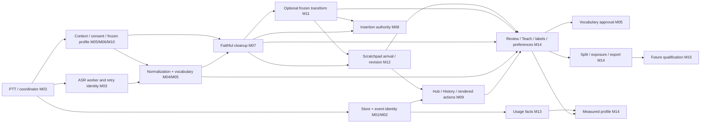

# LocalFlow — Cross-Milestone Read-Only Deep Audit

**Repository:** `scalinity/LocalFlow`  
**Pinned audited source:** `340c566686c7123bfcf721e16160aacabbe0b97d`  
**Prepared:** 2026-09-28  
**Audit type:** static source/contract/evidence review, with synthetic local-verification designs  
**Execution:** all LocalFlow tests, imports, models, native probes, benchmarks, races and mutations **NOT_RUN**

---

## 1. Executive Verdict

### B — Partially sound; needs integrated remediation before M15

The inspected architecture has identifiable owners for persistence, lifecycle, context, faithful cleanup, insertion, note provenance and curation. The evidence does **not** justify a foundational redesign. It also does **not** justify treating the combined M01–M14 product as qualification-ready.

This review establishes **eight source-supported allegations: four High and four Medium**. No Critical defect was established. The highest-value failures are at composition boundaries: a caller bypasses clipboard ownership; a transform revision can disagree with the live definition and then reach export; a stale transform form can undo a later opt-out; and a normalization evidence failure can be represented as a complete cleanup task. Three additional callers erase admitted-write uncertainty, and the current status projection mixes historical and remediated M14 state.

**Coverage qualification:** this is a substantial but bounded source review, not a completed exhaustive census of the entire repository. The full tracked-file consumer scan, complete S29/E19/M15 contract reconciliation, and complete current human-runbook/browser-state enumeration were not finished. Those are explicitly unclosed below. They cannot be silently converted into “no other defects.” Verdict B follows from the inspected code defects; the unclosed areas remain inconclusive, rather than receiving an implicit pass.

The accepted M07 cleanup and M11 Prompt Engineer preservation policies should stay intact. M14's newer approval/fence/benchmark work is materially stronger than its original record, but its consumers still inherit the normalization and transform-definition inconsistencies described here. Fixing those seams is a better next step than either another broad rewrite or a premature model leaderboard.

## 2. Repository / Source Summary

### Pinned identity

The audit used the default `main` branch of the public repository at `340c566686c7123bfcf721e16160aacabbe0b97d`. Main was re-read after the substantive inspection and still resolved to that commit. The GitHub commit record identifies it as the September 28, 2026 M14 evidence/runbook/handoff closeout, with parent `0e5cdcc8287c51ee5218eaef25a119d1fdb6d494`. The earlier M14 production remediation anchor recorded in its addendum is `9d0cfdf85f459149b5382f432f7663cda5b16446`; the later head must not be confused with a claim that all evidence was newly executed at every documentation commit.

The source review followed M12 and M13 ancestry comparisons and the M11 accepted anchor. The M07 anchor was read as an accepted handoff reference, not independently re-proved by a new all-history ancestry sweep. No claim is made that each of fourteen remediation histories was independently reconstructed commit by commit.

A remote branch check cannot prove the user's local worktree is clean, that the installed `.app` contains this source, that a running process was restarted, or that the live database has a particular schema. **All four remain unverified here.**

### Material inspected and limits

| Material | What this audit actually used | What is not claimed |
|---|---|---|
| Root onboarding, START_HERE, contract index and STATUS | Prior pinned reads, current STATUS and contract-index re-reads | A fresh full-repository text scan |
| Canonical SPEC / IMPLEMENTATION_AND_EVALUATION / MILESTONES | Opening and relevant milestone excerpts, plus linked contracts | Complete S29/E19 and every M15 acceptance paragraph were not reconciled |
| M01–M14 handoffs | Implementation/remediation windows, especially M03–M14 closeout/addendum material | Every line of every historical handoff was not reread |
| `app.py` | Startup/lifecycle, capture, deletion, retry, retention, UI transfer/copy/save and terminal callback windows | Every AppDelegate/menu/action caller was not exhaustively enumerated |
| Shared Store, transform store/editor, note API, evidence qualifier/collector and exporter | Direct producer/consumer windows supporting the findings | No execution and no blanket closure of other functions in these modules |
| History/query state, learning and note attribution | Bounded source windows plus owner contracts | Full proof of every miner, query and publication path |
| Native UI | Controller/action source and committed passive/native evidence records | No actual focus, keyboard, VoiceOver, geometry or external-host test in this audit |
| Verification/ORCHESTRATION/browser state | Historical records and status links | Current global V-id count, instruction revisions and browser namespace were not fully enumerated |
| Benchmarks/corpora | Committed results, validity descriptions, selected code/design patterns | None were rerun; no current latency or model-quality result was measured |

Pinned file windows were obtained through the GitHub connector. A complete local source archive was not available in this review environment. The final inventory therefore declares coverage for each row, rather than presenting a partial text search as an exhaustive absence proof.

**Source anchor:** [audited commit](https://github.com/scalinity/LocalFlow/commit/340c566686c7123bfcf721e16160aacabbe0b97d). The complete machine-readable source catalog is included in the package. Each finding also links its exact pinned files.

## 3. Cross-Milestone Architecture Map

The main data plane is capture → worker stages → optional transform → insertion or note delivery. The evidence plane records stage artifacts, task/definition revisions, note origins, user judgments, and current eligibility. The UI is not an independent source of truth: it must bind what was rendered to the authoritative source that the writer or service validates when the action is actually admitted.

The inspected threading model uses a serial Store writer, worker/model boundaries, serialized insertion, background query/action work and main-thread UI publication. One writer does not make every composite API atomic: `update_transform` demonstrates that a pre-op read can still race before its write. Likewise, a correct Store timeout contract does not make a caller truthful if it converts every exception into “not saved.”

The most consequential authority transfers are: capture consent to collector; context scope to hints/profile; normalized input to cleanup provenance; transform definition to immutable revision/export; insertion ticket to every clipboard caller; note receipt to the UI; rendered artifact/hash to Teach/labels/move; and exact evidence membership to profile/export publication.

## 4. Interface Ownership and Consumer-Closure Audit

The companion matrix contains **50 interfaces**, with owner, known consumers, authority fields, writer/thread rule, missing/refusal/unknown semantics, source pointers and explicit closure state. Twelve rows directly trace a producer–consumer pair for an allegation; the other rows are bounded source or contract/handoff maps. None claims a complete census of all production callers.

| Boundary | Owner behavior | Consumer behavior established here | Conclusion |
|---|---|---|---|
| Pending clipboard payload | Guarded copy can refuse an owned payload | Recovery `copyLastRaw_` calls the unguarded helper | XF-AUDIT-01 |
| Preserved transform revision | Revision is intended to name a frozen definition | Pre-read merge can differ from live row; qualifier/export reads preserved row | XF-AUDIT-02 |
| Transform editor authority | Store accepts explicit supplied changes | Full stale form lacks expected revision/delta semantics | XF-AUDIT-03 |
| Normalization evidence failure | Collector records failure and clears retained pointer | Qualifier can treat absence as raw input and still complete | XF-AUDIT-04 |
| Store admission timeout | Admitted operation is not cancelled by wait timeout | Transform CRUD reports `not_saved` | XF-AUDIT-05 |
| Note create timeout | Typed exception contains the note identity | Transform Save discards it and reports failure | XF-AUDIT-06 |
| History Move deletion phase | Source deletion may still commit after timeout | Caller reports a failed move phase | XF-AUDIT-07 |
| Current evidence projection | M14 addendum supersedes current-code claims | STATUS preserves old current-state narrative/pointer | XF-AUDIT-08 |

**Owner/consumer comparison.** The repaired M10 editor pattern, guarded copy callers and M12 note API are useful local reference implementations. Their existence is evidence of the intended pattern, not proof that unrelated transform or Recovery callers automatically use it. The smallest repairs should make those callers conform to existing owners, rather than introduce a second queue, clipboard service, note protocol or eligibility system.

**Closure debt:** enumerate every direct pasteboard write, every use of `Store.submit` at a UI mutation boundary, every `NoteOutcomeUnknown` handler, and every reader of transform revision/provenance. This must be a tracked-source inventory. Search snippets, documentation inventories and a single clean caller are insufficient evidence of no bypasses.

## 5. Lifecycle Walkthrough Results

| Workflow | Source/evidence result | Remaining local proof |
|---|---|---|
| Ordinary dictation through external insertion | Capture/stage identity and guarded insertion architecture are identifiable | Native end-to-end outcome, current host behavior and latency NOT_RUN |
| Failed job → retry | Original provenance and attempt/generation checks appear in the inspected coordinator paths | Deterministic old-generation and destination-authority tests required |
| Changed normalization → cleanup → reviewed export | A specific retained-input failure branch can misstate complete task input | XF-CASE-077 must fail before repair and pass after |
| Transform definition edit → execution → export | Revision numbering alone cannot guarantee preserved-definition equality | Latch disjoint updates and compare actual/preserved/exported definitions |
| Transform form edit after another setting change | Complete stale form can overwrite an unrelated newer setting | Native action binding and conflict preservation required |
| Live paste pending → Recovery Copy | Recovery bypasses the copy gate used by other UI actions | Instrumented clipboard/host verification required |
| Transform result → Save in Scratchpad | Note service has the correct typed unknown; caller discards it | One-note logical retry and visible settlement required |
| History final → Copy/Move into Scratchpad | Final/hash and create-unknown branches are guarded; delete-unknown phase is not | Separate phase-specific latch, no duplicate destination |
| Dictation into edited note → correction mining | Strong receipt/origin/rebase contracts and historical evidence exist | Complete miner/API consumer closure is not established by this review |
| Explicit Teach → approval → next dictation | Reviewed paths intentionally distinguish explicit intent from automatic collection | Reproduce source-current, scoped counterexample and exact undo semantics locally |
| Labels/preferences → split → export | Shared qualification/lineage owners are present; known producer gaps affect them | Membership/exposure/publication races and offline semantic validation NOT_RUN |
| Profile/Insights after deletion | Invalidation and provenance fences are described in current remediation evidence | Complete implementation re-trace and current native presentation still unclosed |
| Quit with late callbacks and admitted writes | Admission/generation/drain boundaries exist in source | No current native shutdown/late-effect certification |

Sixteen full multi-hop sequences in the corpus add checkpoints at admission, commit, publication and final settlement. They deliberately cross multiple ownership boundaries; none is marked as executed.

## 6. Findings — Severity First

| ID | Severity | Cross-milestone defect | Primary verification |
|---|---|---|---|
| XF-AUDIT-01 | High | Recovery copy bypasses pending clipboard ownership | XF-CASE-045 / XF-RACE-003 |
| XF-AUDIT-02 | High | Live/preserved transform revision disagreement reaches export | XF-CASE-041,078 / XF-RACE-001 |
| XF-AUDIT-03 | High | Stale transform form can reverse opt-out | XF-CASE-042 / XF-RACE-002 |
| XF-AUDIT-04 | High | Missing normalized input can retain complete task label | XF-CASE-077,113 / producer fault injection |
| XF-AUDIT-05 | Medium | Transform CRUD collapses admitted uncertainty | XF-CASE-105 / XF-RACE-004 |
| XF-AUDIT-06 | Medium | Transform-to-note Save loses unknown identity | XF-CASE-049 / XF-RACE-005 |
| XF-AUDIT-07 | Medium | History Move misreports pending source deletion | XF-CASE-050 / XF-RACE-006 |
| XF-AUDIT-08 | Medium | STATUS mixes current and historical M14 evidence | XF-CASE-092,100 / static projection check |

### XF-AUDIT-01 — High: Recovery Copy Last Raw bypasses the clipboard-ownership guard

**Status:** Source-supported allegation; local reproduction **NOT_RUN**. **Milestones:** M03 → M08 → M09 → M12. **Class:** Authority bypass. **Confidence:** High for the bypass; native consumption consequence not executed.

**Expected contract.** Every in-app copy action must respect the insertion service's ownership of a pending payload, or make a separately specified and acknowledged override. An unverified paste does not surrender its payload merely because a different menu command runs.

**Observed source.** copyLastRaw_ calls the imported inject.copy_text directly. That helper rewrites the general pasteboard. hubCopyText and tfCopyTransform instead pass through _guarded_copy, which can return clipboard_payload_pending. The Recovery caller does not use that gate.

**Owner → consumer path.** Recovery menu action → AppDelegate.copyLastRaw_ → inject.copy_text → system pasteboard, bypassing AppDelegate._guarded_copy → InsertionService.copy_text.

**Concrete counterexample.** Keep dictation A's payload pending after a posted, unverified transaction. Make a different failed dictation B's raw text available in _last_failed. Invoke Copy Last Raw before A's delayed consumer reads the pasteboard. The caller has no ownership refusal before replacing A's bytes.

**User/system consequence.** A supported in-app copy path can replace bytes reserved for a delayed insertion. Wrong or missing consumption is a native hypothesis to reproduce, not an observed event in this audit.

**Why existing evidence is not enough.** A broker-level ownership test can pass while this legacy caller never enters the broker. The committed M12 caller inventory is historical evidence, not a current exhaustive call-site scan.

**Smallest remediation.** Route this action through the shared guarded-copy command; preserve its refusal reason in the Recovery surface. Inventory every production pasteboard writer, including legacy helpers, rather than changing M08's core protocol.

**Required regression.** Use the real AppDelegate action with a pending ownership ticket and a distinct raw canary. Assert pasteboard generation and payload are unchanged and refusal is visible; release ownership and assert a subsequent copy succeeds. Primary corpus case: `XF-CASE-045`. The case's status is **NOT_RUN**; a written interleaving is not an observed test failure.

**Historical relationship / do-not-change boundary.** New cross-caller composition defect; no allegation that M08's core ownership repair failed.

**Pinned source pointers.** [localflow/app.py](https://github.com/scalinity/LocalFlow/blob/340c566686c7123bfcf721e16160aacabbe0b97d/localflow/app.py#L5830-L6005); [localflow/inject.py](https://github.com/scalinity/LocalFlow/blob/340c566686c7123bfcf721e16160aacabbe0b97d/localflow/inject.py#L1-L150); [localflow/app.py](https://github.com/scalinity/LocalFlow/blob/340c566686c7123bfcf721e16160aacabbe0b97d/localflow/app.py#L2000-L2235); [localflow/v2/insertion/service.py](https://github.com/scalinity/LocalFlow/blob/340c566686c7123bfcf721e16160aacabbe0b97d/localflow/v2/insertion/service.py#L1-L250).

### XF-AUDIT-02 — High: Concurrent transform updates can give one revision two different definitions

**Status:** Source-supported allegation; local reproduction **NOT_RUN**. **Milestones:** M02 → M11 → M14. **Class:** Immutable-provenance inconsistency. **Confidence:** High: deterministic source interleaving.

**Expected contract.** The live definition and the immutable transform_revisions record for the same transform_id/revision must contain the same definition. Export must replay the definition that actually produced the candidate.

**Observed source.** update_transform reads definition() before its mutation op and builds merged from that read. The op updates only the requested SQL columns and increments the live revision. It then reads the new revision number but appends the earlier merged definition. An intervening disjoint update survives in the live row but is absent from the preserved revision.

**Owner → consumer path.** TransformStore.update_transform pre-read → another committed update → partial live-row UPDATE → _append_revision(stale merged definition, current revision number) → transform_target_in reads transform_revisions → DatasetExporter emits that definition.

**Concrete counterexample.** Start r1={name:N0,prompt:P0}. Pause A after reading r1 for a rename to N1. Let B update prompt to P1 and commit r2. Resume A. The live row becomes {N1,P1,r3}; the preserved r3 can be {N1,P0,r3}. A candidate executed from live r3 can subsequently export the preserved P0 definition.

**User/system consequence.** The revision number ceases to identify one reproducible task. The exporter is a direct downstream reader of the inconsistent preserved record. No corrupt dataset was actually generated in this audit.

**Why existing evidence is not enough.** Checking monotonic revision numbers or the row count does not compare the preserved definition with the final live row. Sequential rename and prompt tests miss the interleaving.

**Smallest remediation.** Read the authoritative row, merge and validate the requested delta, perform the update, and serialize exactly that committed definition within one writer op. Preserve revision numbering and append-only history.

**Required regression.** Latch two real update_transform calls at the pre-read boundary. After each commit, compare all canonical definition fields in the live row and matching transform_revisions row. Execute/export a synthetic candidate from the affected revision and independently compare its task definition. Primary corpus case: `XF-CASE-041`. The case's status is **NOT_RUN**; a written interleaving is not an observed test failure.

**Historical relationship / do-not-change boundary.** New M11 storage→M14 export seam; preserve the accepted Prompt Engineer and fidelity gates.

**Pinned source pointers.** [localflow/v2/transforms_store.py](https://github.com/scalinity/LocalFlow/blob/340c566686c7123bfcf721e16160aacabbe0b97d/localflow/v2/transforms_store.py#L200-L335); [localflow/v2/curation/evidence.py](https://github.com/scalinity/LocalFlow/blob/340c566686c7123bfcf721e16160aacabbe0b97d/localflow/v2/curation/evidence.py#L105-L285); [localflow/v2/curation/export.py](https://github.com/scalinity/LocalFlow/blob/340c566686c7123bfcf721e16160aacabbe0b97d/localflow/v2/curation/export.py#L335-L475).

### XF-AUDIT-03 — High: The transform editor can overwrite a later opt-out with an unchanged stale checkbox

**Status:** Source-supported allegation; local reproduction **NOT_RUN**. **Milestones:** M09 → M10 → M11. **Class:** Stale edit authority. **Confidence:** High for stale-form overwrite.

**Expected contract.** An update should act on the rendered definition revision and either apply only the fields the user changed against a validated current row or refuse a conflicting stale form. A name edit must not silently reverse a later auto-apply opt-out.

**Observed source.** transformsUpdate_ sends name, prompt, color, shortcut, enabled, auto_apply and auto_apply_apps from the complete form. It passes no expected revision or changed-field set. update_transform accepts those supplied values. The form can therefore overwrite unrelated changes made after it was filled.

**Owner → consumer path.** Rendered transform form at r1 → external/public-service update to r2 → name-only user edit in old form → transformsUpdate_ sends old checkbox values → TransformStore accepts them.

**Concrete counterexample.** Render a custom transform with auto_apply=True. Disable auto_apply through another admitted control/service call. Change only the name in the still-edited form and press Update. Its unchanged True checkbox is sent again and can reverse the disable.

**User/system consequence.** User intent at one field can overwrite a newer setting in another, including an explicit auto-apply opt-out. This is not a proven wrong-row selection defect; the allegation is stale field authority.

**Why existing evidence is not enough.** A test that edits a fresh form or verifies only stable transform_id cannot catch stale revision or field-delta loss. M10's stronger editor protocol is not automatically inherited by the transform pane.

**Smallest remediation.** Give transform editing the same rendered-id/revision/form binding and delta semantics used by the repaired M10 editors. Refuse conflicts without destroying the user's unsaved form.

**Required regression.** Render, mutate the authoritative row elsewhere, edit one unrelated field, and press the actual Update action. Verify the concurrent opt-out survives or a stale/conflict outcome is shown. Add a fresh-form positive control. Primary corpus case: `XF-CASE-042`. The case's status is **NOT_RUN**; a written interleaving is not an observed test failure.

**Historical relationship / do-not-change boundary.** New consumer inconsistency relative to the established M09/M10 editor contract, not a request for a new editor architecture.

**Pinned source pointers.** [localflow/v2/ui/hub.py](https://github.com/scalinity/LocalFlow/blob/340c566686c7123bfcf721e16160aacabbe0b97d/localflow/v2/ui/hub.py#L1820-L2050); [localflow/v2/transforms_store.py](https://github.com/scalinity/LocalFlow/blob/340c566686c7123bfcf721e16160aacabbe0b97d/localflow/v2/transforms_store.py#L200-L335); [docs/v2/contracts/hub.md](https://github.com/scalinity/LocalFlow/blob/340c566686c7123bfcf721e16160aacabbe0b97d/docs/v2/contracts/hub.md).

### XF-AUDIT-04 — High: Missing normalized-input retention can be exported as a complete model task

**Status:** Source-supported allegation; local reproduction **NOT_RUN**. **Milestones:** M04 → M07 → M14. **Class:** Failure state collapsed into stage absence. **Confidence:** High for the producer/qualifier/export branch.

**Expected contract.** When normalization ran and changed the actual cleanup input, a failure to retain that input must not be represented as if normalization did not run. model_task_complete must identify the exact stage input and prompt provenance.

**Observed source.** on_normalization clears its normalization artifact fields on a retention failure and records a failure reason while leaving the dictation pipeline operational. cleanup_qualification_in treats an absent normalization artifact as a raw-text input fallback. It can still choose model_task_complete from ASR and cleanup-prompt provenance without consulting that normalization failure. The exporter writes the returned input and completeness tier.

**Owner → consumer path.** Successful changed normalization → normalization evidence write/lease failure → cleared normalization pointer with explicit missing reason → cleanup receives the actual changed text → explicit correct mark → cleanup_qualification_in(raw fallback, model_task_complete) → cleanup_supervised record.

**Concrete counterexample.** Synthetic raw text is "ship to cloud"; deterministic normalization produces "ship to Claude". Inject failure only in retaining the normalization evidence, not in executing normalization or retaining the later cleanup prompt. Complete cleanup and mark the applied output intended-correct. The qualifier can export the raw phrase as input with model_task_complete.

**User/system consequence.** A supposedly complete training/evaluation record can bind an output to input bytes the cleanup model did not actually receive. This is an evidence-integrity and M15 qualification blocker, not a claim that dictation output itself changes.

**Why existing evidence is not enough.** Producer-shaped healthy fixtures and tampered-existing-pointer tests miss the absence branch. The code does reject an existing invalid retained normalization reference. Healthy unchanged normalization with a ledger and raw fallback is valid and must remain a positive control.

**Smallest remediation.** Distinguish not-run/unchanged normalization from failed retention using the recorded producer outcome. Refuse the complete tier or downgrade to a truthful text-pair tier when exact input cannot be established. Do not infer exact input from the existence of a rendered prompt alone.

**Required regression.** Drive the real collector through changed normalization with an injected retention failure, then real qualification/export. Independently record the actual cleanup input; assert it is either exported exactly with complete provenance or the record is refused/downgraded. Keep unchanged-normalization and bad-existing-reference controls. Primary corpus case: `XF-CASE-077`. The case's status is **NOT_RUN**; a written interleaving is not an observed test failure.

**Historical relationship / do-not-change boundary.** New M04/M07 producer-failure→M14 consumer mismatch; accepted cleanup semantics stay unchanged.

**Pinned source pointers.** [localflow/v2/training.py](https://github.com/scalinity/LocalFlow/blob/340c566686c7123bfcf721e16160aacabbe0b97d/localflow/v2/training.py#L660-L830); [localflow/v2/curation/evidence.py](https://github.com/scalinity/LocalFlow/blob/340c566686c7123bfcf721e16160aacabbe0b97d/localflow/v2/curation/evidence.py#L105-L285); [localflow/v2/curation/export.py](https://github.com/scalinity/LocalFlow/blob/340c566686c7123bfcf721e16160aacabbe0b97d/localflow/v2/curation/export.py#L335-L475); [docs/v2/contracts/dataset_exports.md](https://github.com/scalinity/LocalFlow/blob/340c566686c7123bfcf721e16160aacabbe0b97d/docs/v2/contracts/dataset_exports.md#L45-L145).

### XF-AUDIT-05 — Medium: Transform CRUD reports admitted timeouts as not_saved and Add can duplicate

**Status:** Source-supported allegation; local reproduction **NOT_RUN**. **Milestones:** M02 → M09 → M11. **Class:** Unknown outcome misclassified. **Confidence:** High for timeout propagation and new-ID retry.

**Expected contract.** A queued mutation whose reply times out is outcome_unknown, not confirmed failure. Retrying the same logical Add must reconcile one stable identity rather than mint another transform.

**Observed source.** HubController._transform_write catches every exception, including an admitted Store timeout, and renders not_saved. transformsAdd_ does not preallocate/reuse transform_id, although add_transform accepts that optional parameter. Repeating Add after the first queued op eventually commits can allocate a second id.

**Owner → consumer path.** Transform Add → add_transform(new id) → Store.submit admits op → reply timeout → _transform_write displays not_saved → same user action repeated → new id → two commits.

**Concrete counterexample.** Hold the writer past the submit wait after Add has been admitted. Observe the UI timeout, then release the writer so the first transform commits. Repeat the same Add fields. The caller has no retained operation identity linking the second request to the first.

**User/system consequence.** Duplicate definitions and misleading status; update/toggle/delete share the false failure label even where they do not duplicate rows.

**Why existing evidence is not enough.** Testing the store's non-cancelling timeout alone does not test the caller's message or retry identity. Optional transform_id support is not an end-to-end reconciliation protocol.

**Smallest remediation.** Return/render not_started, refused/failed, and outcome_unknown distinctly. Keep a preallocated identity or receipt for a logical Add until its outcome is known, and reconcile before another creation.

**Required regression.** Latch real Store admission and commit, trigger Add through the real Hub action, then repeat with the same logical operation. Assert one transform, one initial preserved revision, truthful unknown status, and eventual reconciliation. Primary corpus case: `XF-CASE-105`. The case's status is **NOT_RUN**; a written interleaving is not an observed test failure.

**Historical relationship / do-not-change boundary.** An older CRUD caller did not inherit M02's outcome semantics; the underlying Store timeout behavior is intentional.

**Pinned source pointers.** [localflow/v2/ui/hub.py](https://github.com/scalinity/LocalFlow/blob/340c566686c7123bfcf721e16160aacabbe0b97d/localflow/v2/ui/hub.py#L1820-L2050); [localflow/v2/transforms_store.py](https://github.com/scalinity/LocalFlow/blob/340c566686c7123bfcf721e16160aacabbe0b97d/localflow/v2/transforms_store.py#L200-L335); [localflow/v2/store.py](https://github.com/scalinity/LocalFlow/blob/340c566686c7123bfcf721e16160aacabbe0b97d/localflow/v2/store.py#L1240-L1415).

### XF-AUDIT-06 — Medium: Save Transform to Scratchpad discards the note service's unknown-outcome identity

**Status:** Source-supported allegation; local reproduction **NOT_RUN**. **Milestones:** M02 → M11 → M12. **Class:** Cross-service outcome collapse. **Confidence:** High for caught typed exception and fresh-ID retry.

**Expected contract.** A NoteOutcomeUnknown(create, note_id) must reach a caller-owned pending operation that can reconcile the same note id. It must not become an ordinary create_failed result.

**Observed source.** NoteStore.create_note allocates an id before admission, supports a supplied note_id, and raises NoteOutcomeUnknown with that identity on admitted timeout. tfSaveToScratchpad calls create without a retained id, catches generic Exception, emits notes.save_transform_failed and returns None. A repeated save starts another creation.

**Owner → consumer path.** Transform result → tfSaveToScratchpad → NoteStore.create_note → admitted timeout with typed identity → generic catch discards identity → repeat Save → fresh note.

**Concrete counterexample.** Keep a valid transform result on screen. Stall its note creation after admission, let the caller return from the timeout, then let the original op commit. Invoke Save again. The caller does not reconcile the first note identity.

**User/system consequence.** A saved note can be reported as failed and repeated saves can create duplicates. This does not establish that the note service itself loses data.

**Why existing evidence is not enough.** M12 editor arrival/receipt tests do not cover this M11 transform-result command unless it is explicitly driven through the real caller.

**Smallest remediation.** Preserve the note id and a typed pending result across this caller; repeat/reconcile the same operation. Keep the panel result available until settlement and do not label admitted uncertainty as failure.

**Required regression.** Invoke the real tfSaveToScratchpad with a synthetic result and latched Store. Verify one note after timeout/retry, a stable id throughout, and correct origin=transform. Run a refusal-before-admission control. Primary corpus case: `XF-CASE-049`. The case's status is **NOT_RUN**; a written interleaving is not an observed test failure.

**Historical relationship / do-not-change boundary.** New caller gap composed across M11 and the repaired M12 note API.

**Pinned source pointers.** [localflow/app.py](https://github.com/scalinity/LocalFlow/blob/340c566686c7123bfcf721e16160aacabbe0b97d/localflow/app.py#L2000-L2235); [localflow/v2/notes.py](https://github.com/scalinity/LocalFlow/blob/340c566686c7123bfcf721e16160aacabbe0b97d/localflow/v2/notes.py#L285-L640); [localflow/v2/store.py](https://github.com/scalinity/LocalFlow/blob/340c566686c7123bfcf721e16160aacabbe0b97d/localflow/v2/store.py#L1240-L1415).

### XF-AUDIT-07 — Medium: History Move reports source deletion failed when its outcome is still unknown

**Status:** Source-supported allegation; local reproduction **NOT_RUN**. **Milestones:** M02 → M09 → M12. **Class:** Two-phase user action misreported. **Confidence:** High for deletion-timeout catch.

**Expected contract.** After a note copy is durably created, an admitted source-deletion timeout must be reported as copy_created/source_deletion_unknown. A move is not complete until that phase settles, and confirmed source preservation must not be implied.

**Observed source.** hubSaveHistoryRow correctly handles an unknown note creation and avoids deleting the source then. But after successful creation its move branch catches all exceptions from delete_everywhere/delete_legacy_row as move_failed_note_copied. A Store timeout does not cancel that admitted deletion.

**Owner → consumer path.** Strict History final/hash check → stable-id note creation succeeds → source delete admitted → timeout → move_failed_note_copied → source deletion may commit later.

**Concrete counterexample.** Complete the note creation phase of Move. Hold only the source delete op after admission past its wait. Observe the returned status, then release the delete. The source can disappear after the caller reported the deletion phase as failed.

**User/system consequence.** Misleading source-state information and an unsafe retry model. The destination note is already durable; no unsupported claim of destination loss is made.

**Why existing evidence is not enough.** A create-timeout test passes because that branch is already handled correctly. This requires a separate latch specifically after source-deletion admission.

**Smallest remediation.** Represent the two phases separately and preserve a move/deletion identity until reconciliation. Retrying must reuse the existing destination note and settle the source phase only.

**Required regression.** Latch the source-delete phase of real hubSaveHistoryRow(move=True). Assert one destination note, truthful source-deletion-unknown status, eventual reconciliation, and no second copy on retry. Preserve the existing create_unknown positive control. Primary corpus case: `XF-CASE-050`. The case's status is **NOT_RUN**; a written interleaving is not an observed test failure.

**Historical relationship / do-not-change boundary.** Narrow cross-phase gap in an otherwise guarded M12 History transfer.

**Pinned source pointers.** [localflow/app.py](https://github.com/scalinity/LocalFlow/blob/340c566686c7123bfcf721e16160aacabbe0b97d/localflow/app.py#L2000-L2235); [localflow/v2/notes.py](https://github.com/scalinity/LocalFlow/blob/340c566686c7123bfcf721e16160aacabbe0b97d/localflow/v2/notes.py#L285-L640); [localflow/v2/store.py](https://github.com/scalinity/LocalFlow/blob/340c566686c7123bfcf721e16160aacabbe0b97d/localflow/v2/store.py#L1240-L1415).

### XF-AUDIT-08 — Medium: STATUS.json presents historical M14 details as current state

**Status:** Source-supported allegation; local reproduction **NOT_RUN**. **Milestones:** M01 → M14 → M15. **Class:** Documentation authority drift. **Confidence:** High for contradictory current/historical claims.

**Expected contract.** A current-state projection must identify the current production schema, algorithm contract and applicable evidence. Historical acceptance results remain dated, immutable records rather than current claims.

**Observed source.** STATUS.json has current M14-V001..V007 pending ids, but status_reason still describes schema v10, plan-before-effect approval, and the original performance figures; benchmark_runs points to the original September 24 run. The September 28 addendum explicitly supersedes current-code claims with schema v13, one-op approval and validity-gated newer measurements.

**Owner → consumer path.** Historical M14 acceptance → partially refreshed STATUS current-state fields → fresh agent/M15 preparation consumes mixed-era state.

**Concrete counterexample.** A fresh session reads STATUS first as START_HERE directs. It can plan a v9→v10 migration or use old 54/50.3 ms writer-wait figures even though the current addendum describes schema13 and maxima205/174 ms.

**User/system consequence.** Wrong qualification premises and misleading provenance, despite correct historical records being retained elsewhere. This is not evidence that the installed app or live database currently has any particular schema.

**Why existing evidence is not enough.** A syntactically valid JSON/status-id check will not compare the narrative and evidence pointers to the current remediation addendum.

**Smallest remediation.** Add/update an explicitly current remediation projection with full code/evidence refs and current schema. Keep the original source_commit and benchmarks as labeled historical entries, not overwritten history. Reconcile runbook counts from the actual stable-id set.

**Required regression.** Statically validate that current schema/production/evidence pointers agree with the addendum and that old records remain byte-identical. Independently enumerate runbook ids and distinguish pending records by their instruction revision. Primary corpus case: `XF-CASE-092`. The case's status is **NOT_RUN**; a written interleaving is not an observed test failure.

**Historical relationship / do-not-change boundary.** Partially refreshed current projection, not a request to rewrite accepted historical evidence.

**Pinned source pointers.** [docs/v2/STATUS.json](https://github.com/scalinity/LocalFlow/blob/340c566686c7123bfcf721e16160aacabbe0b97d/docs/v2/STATUS.json); [docs/v2/handoffs/M14.md](https://github.com/scalinity/LocalFlow/blob/340c566686c7123bfcf721e16160aacabbe0b97d/docs/v2/handoffs/M14.md#L180-L280).

### Investigated but not promoted to findings

History search can match retained attempt text while detail renders the current final. The inspected contract permits retained-stage search; a broader search scope is not, by itself, proof of an incorrect current final. The corpus retains a policy/control probe, not a fabricated wrong-target allegation.

The explicit refusal to Teach from a transformed final is intentional and protective. A healthy unchanged normalization ledger with raw input is also valid. Neither should be “fixed” by widening eligibility or forcing artificial normalized-text artifacts.

The note miner's separate attribution logic warrants independent repeated-occurrence tests, but duplication of logic alone does not prove a wrong candidate. Similarly, not every stale worker, profile, export or replay hypothesis was driven through its full consumer path. Those remain verification debt rather than extra counted defects.

## 7. Global Invariant Audit

| Invariant | Audit conclusion | Evidence/next proof |
|---|---|---|
| One job/capture identity across retries | Bounded source support; no new defect established | Old-attempt and sample-rate probes; full consumer scan unclosed |
| Capture-boundary consent controls retained evidence | Inspected freeze/collector design is coherent | Late-enable/retry consent scenarios NOT_RUN |
| Deletion dominates late writes and UI publication | Strong owner contracts and prior remediation | Exact write/publication latches required; not blanket certified |
| Unknown facts stay unknown | Contract requirement; no blanket new failure alleged | Null/time/revision and legacy-import controls |
| Store timeout is not cancellation | Directly established | Three consumer violations: XF-05/06/07 |
| One immutable revision identifies one definition | Violated by a concrete source interleaving | XF-02 |
| User edit acts only with current rendered authority | Violated in transform form field semantics | XF-03; other panes need current full closure |
| Every clipboard writer respects payload ownership | Violated by one concrete caller | XF-01; exhaustive pasteboard scan outstanding |
| Model-task-complete means exact task input | Violated under a producer retention failure | XF-04 |
| Faithful cleanup preserves explicit meaning/literals | Accepted M07 policy must remain | New model execution and all semantic oracle checks NOT_RUN |
| Prompt Engineer cannot drop explicit requirements | Accepted M11 policy must remain | No rationale here to relax its gate |
| Applied final never silently falls back | Source-supported History behavior | Purged-transformed-final control and every action consumer |
| Typed note text is not speech evidence | Strong M12/M14 contract and historic work | Independent repeated-occurrence/provenance oracle |
| Partial correction is not whole-example truth | Contract requirement | Real labeling/readiness/export integration |
| Preference choice uses displayed comparable tasks | Contract/source owner identified | Slot reorder and latest-judgment probes |
| Frozen-test exposure is forward-only | Current M14 contract/handoff | Cross-version and publication-fence execution |
| Export does not use dead or changed exact inputs | Current remediation describes scoped fence | Full publication source re-trace plus deletion/exposure latches |
| Profile measurements use eligible user-speech population | Current evidence is explicit about exclusions | Independent population oracle and deletion fence |
| Usage deletion clears derived copies too | Current remediation explicitly addresses it | Snapshot/UI copy checks, not source-row deletion alone |
| Historical evidence is not a current pass | Violated by mixed STATUS projection | XF-08; retain historical records unchanged |
| Benchmark success requires actual valid work | Newer M14 evidence improves this substantially | No-op mutants and independent exact work counts |
| Current human acceptance belongs to current instructions/build | Current global state not established | Full stable-id/browser-state inventory required |

The phrase “no new defect established” means exactly that. It does not replace a missing owner–consumer trace with PASS.

## 8. Native UI Audit

The direct UI review concentrated on transform CRUD and the AppDelegate commands that save/copy/move content. The current transform pane's `transformsUpdate_`/`_tf_fields` and generic `_transform_write` are concrete weak spots: they lack the stronger rendered-revision/delta and unknown-outcome semantics described for the repaired M10 editors.

History transfer's current-final/hash check is a positive control. Its `create_unknown` branch correctly avoids deleting source before destination creation settles. The later source-delete exception branch is the narrower defect. Similarly, the shared guarded-copy refusal is a positive control; the Recovery caller is the bypass.

The broad Hub architecture has per-query generations, source revocation and rendered action concepts. A code review can examine those concepts, but it cannot prove that Cocoa dispatch actually occurs on the expected queue, that a popup reflects the same candidate order the user saw, that an error redraw does not clear unsaved input, or that larger text does not hide a critical control. The corpus includes real dispatch/drain, selection-before-render, older-error-after-new-success, and resize/keyboard probes.

No native UI was opened in this audit. No focus behavior, insertion host, accessibility tree, screenshot geometry, keyboard order, VoiceOver result or dark/light/system-text layout is newly certified. Historical passive AppKit probes are not substitutes for the current installed-build human checks.

**Current tracking limit:** STATUS identifies M14-V001 through M14-V007 as pending. The complete current set across M01–M14, its count and browser-local completion namespace were not independently enumerated. Historical counts in individual handoffs are not added together into an invented current total.

## 9. Tests / Acceptance / Evidence Inventory

| Evidence class | What it can establish | Status in this audit |
|---|---|---|
| Pinned production source | A call path, missing condition or deterministic interleaving | Used directly for findings |
| Owner contracts | Intended semantics and explicit non-goals | Used; full S29/E19 reconciliation remains open |
| Handoff claims / acceptance JSON | What a previous run reported at its source/environment | Reviewed as historical reports, not reruns |
| Portable semantic tests | Real service state effects under synthetic inputs | Proposed/new probes NOT_RUN |
| Native passive tests | Specific controller construction/action behavior on a recorded Mac build | Historical only; no current-host certification |
| Native interactive tests | Actual focus, clipboard, audio, keyboard and rendering outcomes | NOT_RUN here |
| Metamorphic tests | Relations preserved across meaningful input transformations | 14 proposed relations; NOT_RUN |
| Mutation tests | Whether the independent oracle detects a reachable broken behavior | 16 proposed targets; NOT_RUN |
| Corpus classifiers/structural checks | Shape, schema and declared predicates | Useful scaffolding; not semantic correctness alone |
| Performance runs | Workload-specific timing once actual work is independently validated | Historical observations only |
| JSON/report package checks | Counts, IDs, links, parseability and internal consistency of this package | Executed locally on audit artifacts only |

The newer M14 handoff reports a broader corpus/probe/metamorphic/mutation campaign, native passive checks and validity-gated performance work. Those claims should be cited with their recorded source and environment, not copied into a present-tense “all tests passed.” Earlier M03–M13 campaigns also contain substantial focused remediation evidence, but their aggregate size does not prove the specific callers in XF-01 through XF-07 were exercised.

Required missing inventory items are the complete current test file/callable list, actual fixture-driver bindings for every new case, a full consumer census for each interface, and the exact current human-runbook instruction/id/browser-state set. Their absence is recorded, not disguised as an empty test suite or a clean result.

## 10. Test-of-Tests Findings

**Stage absence versus stage failure is a fixture validity trap.** A handwritten cleanup envelope with a valid normalization pointer tests a different branch from a real producer that records retention failure and clears that pointer. The fix must be driven from `EvidenceCollector.on_normalization`, not merely from a manually edited export record. The independent oracle must capture actual cleanup input before serialization.

**Revision counters are not a definition oracle.** Monotonic revision and append-only row-count assertions can all pass while r3 names two definitions. Compare canonical fields across the live row, preserved row, executed task and exported record. The test must latch the pre-op read, not rely on probabilistic thread scheduling.

**Owner tests do not prove caller adoption.** M08's broker can pass every test while `copyLastRaw_` bypasses it. NoteStore can correctly raise `NoteOutcomeUnknown` while a caller discards it. A valid test must invoke the real user-facing command and assert the propagated status and final side-effect count.

**Create-phase tests do not prove Move semantics.** The existing History create-unknown branch is protective. Only holding the later source-delete phase reveals XF-07. A harness that delays every writer operation together can stop too early and never reach the alleged branch.

**A stale id test is weaker than a stale form test.** Retaining the same transform id does not prevent an unchanged checkbox from overwriting a later opt-out. Preserve the form buffer while another write commits, edit one different field, and inspect both state and visible refusal/conflict behavior.

**No-op timing is not speed.** A fast profile, export, sampling or report path that processed zero eligible inputs has not measured the declared workload. Assert exact expected population, actual output cardinalities, audio bytes and semantic lineage independently before interpreting timings. No-op mutants must be rejected as invalid work even if the stopwatch reports an attractive number.

**Mutation reachability must be explicit.** A mutation that failed to apply, was not reached, was masked by a separate still-valid gate, or died in setup is not automatically a killed mutant. Record exact patch anchors, reach markers and the failing semantic assertion. Where defense-in-depth masks one weakened guard, name the surviving protection rather than overclaiming coverage.

**Evidence maturity is not additive.** A thousand table rows, dozens of probes and many labeled mutations are not one integrated proof unless they reach production behavior and observe the claimed state. This audit does not assign a new pass rate to historical campaigns it did not rerun.

## 11. Adversarial Corpus Summary

The JSON companion contains **116 fully synthetic cases across the 29 requested categories**, plus **16 multi-hop scenarios**, **18 deterministic race/ordering probes**, **14 metamorphic relations** and **16 mutation targets**. Every proposed item is **NOT_RUN**. No real user's transcript, note, audio, path or credential is embedded.

Each case names milestones, a production boundary, setup, operation sequence, expected behavior, independent oracle, relevant pinned sources, verification class, required state/side effects, forbidden effects, platform/model needs and an explicit non-execution reason. A local driver must bind to actual production callables and fail closed if a required hook or platform capability is unavailable. The blueprint is not a pre-existing runnable suite and does not pretend otherwise.

| Case range | Category |
|---|---|
| XF-CASE-001–004 | Session and artifact identity |
| XF-CASE-005–008 | Worker recovery and retries |
| XF-CASE-009–012 | Cancellation and shutdown |
| XF-CASE-013–016 | Consent changes |
| XF-CASE-017–020 | Deletion propagation |
| XF-CASE-021–024 | Retention and leases |
| XF-CASE-025–028 | Mode interactions |
| XF-CASE-029–032 | Context degradation |
| XF-CASE-033–036 | Dictionary and personal vocabulary |
| XF-CASE-037–040 | Snippet and literal preservation |
| XF-CASE-041–044 | Transform chains and definition edits |
| XF-CASE-045–048 | Clipboard and insertion authority |
| XF-CASE-049–052 | Scratchpad workflows |
| XF-CASE-053–056 | History and recovery workflows |
| XF-CASE-057–060 | Explicit teaching |
| XF-CASE-061–064 | Learning and approval |
| XF-CASE-065–068 | Training Data labeling |
| XF-CASE-069–072 | Preferences and judgments |
| XF-CASE-073–076 | Splits and exposure |
| XF-CASE-077–080 | Exports and completeness |
| XF-CASE-081–084 | Profile invalidation |
| XF-CASE-085–088 | Analytics semantics |
| XF-CASE-089–092 | Native UI rendered identity |
| XF-CASE-093–096 | Diagnostics and honesty |
| XF-CASE-097–100 | Compatibility and historical evidence |
| XF-CASE-101–104 | Missing and partial evidence |
| XF-CASE-105–108 | Concurrency and outcome_unknown |
| XF-CASE-109–112 | Performance under growth |
| XF-CASE-113–116 | Negative controls |

The first local campaign should prioritize the eight finding-linked cases and their positive controls, then run the multi-hop scenarios. A complete corpus execution should not begin by labeling all rows “pass” based on expected outcomes; actual observations must be written only after the real production boundary is reached.

## 12. Metamorphic and Mutation Recommendations

The metamorphic set covers same-job retries, no-op settings, edits outside selected note regions, same-task transform retries, same-label/different-id substitution, unchanged reviewed stage text, related versus unrelated deletion, stable logical-operation retries, healthy unchanged normalization, out-of-order success/error publication, family-order permutation, scoped counterexamples and disabled personalization.

The mutation set targets old-attempt acceptance, clipboard bypass, stale transform merge, stale form writes, each unknown-outcome collapse, missing-normalization completeness, write-time tombstones, UI revocation, profile/export fences, typed-origin contamination, preference slot rebinding, retry double-counting and no-op benchmark work.

For each mutant, report separately: source/patch identity; application success; reachability; actual semantic assertion; killed/survived/invalid/blocked result; and the unchanged-code control. A current defect is a baseline expected failure to repair, not a newly “killed mutant.” After repair, reintroducing that precise behavior can become a meaningful mutation target.

This report makes no mutation score claim. All 16 targets and all 14 relations remain NOT_RUN.

## 13. Prior Remediation / Residual Verification

The table below is a ledger of how historical evidence was treated, not a new certification of each milestone.

| Milestone | Accepted/remediated foundation preserved | Residual or cross-seam disposition |
|---|---|---|
| M01 | Versioned, source/environment-bound events and evidence; immutable older baseline | Installed bundle/current build identity and full runbook state unverified; do not relabel historical runs |
| M02 | Serial writer, write-time liveness, managed payloads, tombstones/leases and explicit purge outcomes | Queue timeout semantics are correct but three callers misreport them; broader deletion consumer sweep open |
| M03 | Job/attempt/generation identity, bounded worker/recovery transport, original capture provenance | Real recording/retry/shutdown still requires native verification; no redesign indicated |
| M04 | Deterministic normalization, protected spans and explicit policy; honest residual intent ambiguities | New retention-failure consumer mismatch XF-04; do not weaken normalization policy to hide it |
| M05 | Approved-only dictionary influence, precedence/masking, deterministic vocabulary composition | Exact scope/undo semantics remain important; current full approval consumer trace unclosed |
| M06 | Per-job context ownership, source trust, bounded finalization and late-delta lineage | Native AX/scope behavior and some large-vocabulary performance policies remain distinct verification concerns |
| M07 | Accepted faithful-cleanup repair and deliberate fidelity policy | Preserve meaning/literal/requirement gates; model calibration and real end-to-end quality belong to M15 |
| M08 | Serialized ownership, readback honesty, irreversible-phase cancellation and submission handshake | New Recovery caller bypass XF-01, not a reason to rewrite the core insertion service |
| M09 | Current-final resolution, query supersession, revocation and rendered action semantics | Full current pane/action enumeration unclosed; transform editor inconsistencies are concrete |
| M10 | Frozen writing profiles, scope/skill rules and repaired stable editor bindings | Reuse its editor pattern for M11 instead of reworking modes/skills |
| M11 | Accepted Prompt Engineer/fidelity gates and frozen transform-task design | New revision preservation and stale editor defects XF-02/03; caller outcomes XF-05/06 |
| M12 | Occurrence-safe note provenance, arrival durability, typed unknown outcomes and strict History final transfer | Transform Save loses note identity; Move loses delete-phase uncertainty; no note-service rewrite required |
| M13 | Logical-job analytics, report cohort consistency, reporting-zone/unknown-time semantics | Do not count retries, transformations or repastes as new dictations; current native charts/manual checks unverified |
| M14 | Newer schema13/atomic approval, narrower source checks, exact-input fences and validity-gated workload evidence | XF-04 and XF-02 compromise downstream data truth; STATUS drift XF-08; manual acceptance remains pending |

The M14 addendum also records bounded residuals such as late export-status presentation, crash/publication bookkeeping edge cases, limited undo UI, and phrase/casing or later-changed-intent behavior. They should retain their own identifiers and exact scope in the local ledger. They are not silently recategorized as new findings here, nor declared closed because the eight new findings have a separate table.

Historical M01–M13 manual counts and per-milestone V-id ranges are not automatically current: instructions and browser namespaces can change. The only explicit current slice independently identified in STATUS for this report is M14-V001..M14-V007, all pending. A complete current census is a required handoff task.

## 14. Documentation Drift

XF-08 is a specific contradiction, not a complaint that history exists. An old source commit or benchmark is valid when labeled as the record it was. The problem is a current `status_reason` and benchmark projection that can still be consumed as present behavior while the remediation addendum explicitly changes the schema, approval mechanism and relevant performance interpretation.

Current and historical dimensions should be separate: implementation origin; accepted remediation production commit; evidence-producing commit; current repository head; installed-build hash; native/manual acceptance state; and superseded historical result references. One ambiguous “source commit” field should not be overloaded to mean all seven.

The exact runbook/browser state was not reconciled in this audit. The local static follow-through must enumerate real stable ids from the current complete files, compare them to STATUS, preserve historical outcomes with their instruction revisions, identify the current localStorage namespace/reset policy, and compute counts from that set. It must not reset human checkboxes to green or rewrite old evidence to match the current code.

The canonical M15/S29/E19 requirements also need a complete line-by-line reconciliation before qualification. The examined excerpts establish the importance of model quality, reproducibility and performance, but they are not a substitute for that remaining read.

## 15. Privacy / Deletion / Retention Review

No user database, note store, transcript, audio, diagnostics export, model cache or installed application was opened in this audit. Synthetic corpus fixtures deliberately use generic ids and canaries. Artifact generation touched only the audit output directory.

The inspected design has several sound privacy ownership ideas: content-free event envelopes; separately governed payload artifacts; capture-boundary consent; tombstones checked at write admission; pending purge rather than false deletion success; and UI/profile/export invalidation. Their correctness depends on every consumer keeping the same authority and failure semantics. This audit does not claim an exhaustive privacy certification of those consumers.

XF-01 is relevant to content destination safety: a raw payload from one job can replace bytes reserved for another pending insertion. XF-06/07 are relevant to truthful user control over saved and deleted copies. XF-02/04 concern provenance integrity of locally retained/exported task data; they are not evidence that data was sent to a network service.

The high-value deletion probes include job deletion before collector finalize, note-source deletion after mining, deletion between query read and native publication, usage deletion after copying aggregates into a profile, and exact-source deletion before export publication. Assert both storage and rendered buffers. A missing source row is not sufficient if the same private text survives in a derived snapshot, draft, stale UI callback or export staging record.

Exports intentionally contain user-authorized task payloads and local audio references where eligible. Diagnostics should remain content-free/redacted. These are different disclosure boundaries and must not share a vague “export is safe” conclusion.

## 16. Performance / Scalability Review

No timing was measured in this audit. The current handoff's newer workload validity checks are more decision-useful than a single attractive stopwatch figure. It explicitly distinguishes useful output work, input population, writer wait and component throughput, and reports larger writer waits than the original M14 summary still shown in STATUS.

For example, the newer addendum reports maximum dictation-writer waits of **205 ms during profile work** and **174 ms during export**, whereas the stale projection cited **54 ms** and **50.3 ms**. These are historical measurements under their recorded fixtures, not current measurements here. Their significance is that source/version and workload validity matter; a current agent must not choose the old smaller numbers as the applicable result.

The core scaling risk is coordination cost: consistent snapshots and long work can queue behind the same writer that serves latency-sensitive dictation operations. Expensive analysis and streaming should stay outside the writer where the existing consistency contract permits it, while the final eligibility/identity decision remains authoritative. Do not trade away deletion or evidence fences merely to improve a benchmark.

The proposed campaign first independently validates 10k-example population, actual eligible word count, family memberships, output row counts and audio bytes. It then measures per-component time/memory and continuous dictation-write wait with p50/p95/p99/max and sample count. Separately, a later native run measures capture/release-to-insert, fallback behavior and model quality. No hard latency threshold is invented where the current milestone has not declared one; record the observation and apply the actual canonical acceptance budget.

No-op mutants are essential. A missing helper, zero admitted observations, empty export, invalid family floor or no regenerated profile must make the claimed workload INVALID rather than fast-and-green.

## 17. Minimal Remediation Order

**0 — Close source identity and static coverage bookkeeping.** On the full local checkout, verify the pinned base and current branch, inventory the affected production callers, and reconcile current runbook/status/contracts without changing accepted outcomes. Record any intervening commits separately. Do not reset or force-sync the user's worktree.

**1 — Restore clipboard caller conformity (XF-01).** Add the smallest guarded Recovery copy route and its refusal/status test. This protects an external side effect and should not require changes to the accepted insertion ownership algorithm.

**2 — Make transform definition edits atomic and current (XF-02/03).** Fix authoritative merge/preservation in one writer op, then apply rendered-revision/delta semantics to the editor. Prove the opt-out and disjoint-update cases independently; one fix does not automatically fix the other.

**3 — Preserve exact cleanup input completeness (XF-04).** Carry the producer's not-run/unchanged/failed distinction into qualification. Test the real failure-shaped envelope, complete positive control and truthful incomplete tier. Do not simply reject every normalization ledger.

**4 — Repair caller outcome protocols (XF-05/06/07).** Reuse stable operation identities and typed not-started/refused/unknown/settled results. For Move, track destination creation and source deletion separately. Do not “fix” unknown by cancelling already-admitted writes or blindly retrying them.

**5 — Reconcile current documentation/evidence projection (XF-08).** Update current fields and pointers, retain historical artifacts unchanged, and compute actual current manual-id counts. Do this against the final remediation code/evidence identity, not a guessed future SHA.

**6 — Run focused semantics before broad sweeps.** For each finding, first demonstrate the failure or a source-supported refutation on the original code with an actually reached oracle, then verify the bounded repair and negative controls. Follow with the 16 multi-hop scenarios, mutation reachability and existing acceptance sweeps. Native/manual tests remain explicit until actually run.

**7 — Reassess M15 admission.** Only after evidence truth and effect/outcome authority are repaired should qualification results be treated as decision-grade. Planning a future campaign is not the same as authorizing training or declaring the product qualified.

## 18. Explicit Do Not Change List

Preserve the accepted M07 faithful-cleanup rules, M11 Prompt Engineer explicit-requirement/literal gate and their fail-closed fallback semantics. Do not make source preservation optional to improve an output score.

Preserve the M08 serialized insertion service, ownership tickets, readback honesty and irreversible-post cancellation distinction. Fix the bypassing caller; do not add a second clipboard authority.

Preserve the Store's non-cancelling admitted timeout semantics and the M12 note receipt/origin model. Repair caller reconciliation instead of treating a timeout as proof that no write happened.

Preserve strict applied-final selection, typed-versus-dictated note attribution, explicit-intent Teach semantics, partial-versus-whole evidence distinctions, append-only transform/annotation/judgment history, family-disjoint frozen splits and forward-only exposure.

Preserve historical evidence bytes and source identities. Do not edit old records into a current pass, invent current manual completions, or change human-runbook browser state without the explicit current instruction/version policy.

Do not launch live models, record audio, send network requests, touch the user's real corpus, start M15 training, or initiate a broad architecture rewrite merely because this report contains a local handoff. Those actions were not performed by this audit.

## 19. Most Valuable Next Local Verification

The highest-yield first run is a small real-API, synthetic-store campaign, not a full model benchmark. Latch the transform revision race and normalization-retention failure first: both directly affect whether an M15 example tells the truth about its generating task. In parallel as source work, complete the direct pasteboard-write and unknown-outcome caller inventories.

Then use an instrumented native fixture for the Recovery copy collision, stale transform form, Transform Save, and two-phase History Move. These probes must invoke the actual AppDelegate/Hub commands and drain the real queued publication boundary; isolated service mocks cannot establish caller correctness.

For every probe, capture base/repair SHA, fixture hash, source-bound hook, hook-reached marker, real service/caller, expected invariant, actual result, side-effect count, refusal/unknown state and relevant stored ids/digests. Native records must identify the actual build/environment. Refutations are acceptable when they show the exact production path and a falsifying observation; “could not reproduce” without reaching the specified interleaving is not closure.

After these targeted probes, execute the multi-hop scenarios and current existing acceptance suites, then the outstanding human runbook on the intended installed build. Current manual ids/instructions must be enumerated before execution, not reconstructed afterward from old totals.

## 20. M15 Readiness Recommendation

**Do not start decision-grade M15 model qualification or data-dependent tuning on the assumption that M01–M14 is closed.** The task-definition and normalized-input defects can make the evaluation evidence itself wrong. Faster or better-looking model outputs cannot repair mislabeled inputs after the fact.

M15 planning and harness design may continue without executing models or adopting results. A sensible admission gate is: XF-01..XF-07 repaired or specifically refuted with real reached tests; XF-08 current projection reconciled; critical owner–consumer sweeps completed; complete S29/E19/M15 contract read; exact current runbook/manual state known; and data-quality/split/exposure checks passing on a synthetic then explicitly authorized real corpus.

The result is **targeted remediation before qualification**, not “restart LocalFlow” and not “everything else passed.” Remaining uninspected scope stays visible in the acceptance decision.

## 21. Downloadable Artifacts

- `LocalFlow_Cross_Milestone_Read_Only_Deep_Audit.md` — this report, in the requested 22-part order.
- `LocalFlow_Cross_Milestone_Adversarial_Corpus.json` — 116 cases, 16 multi-hop scenarios, 18 race probes, 14 relations and 16 mutation targets; all NOT_RUN.
- `LocalFlow_Cross_Milestone_Interface_Matrix.md` — 50 owner/consumer/authority rows with coverage and closure qualifications.
- `localflow_cross_milestone_interface_inventory.json` — machine-readable companion to the matrix.
- `LocalFlow_Cross_Milestone_Remediation_Handoff.md` — bounded local reproduction/remediation instructions and acceptance gates.
- The ZIP additionally includes finding metadata, a pinned source catalog and an artifact-validation manifest.

## 22. Final Self-Check

| Check | Result |
|---|---|
| Pinned source/head identity stated and rechecked | Yes; main remained at the audited SHA |
| Repository edits, commits, branches or pushes | None performed |
| Target imports/tests/native UI/models/benchmarks/mutations | All NOT_RUN |
| Live user data or installed app inspected | No |
| Findings include owner/consumer path and a concrete counterexample | Yes; eight allegations, explicitly static |
| Accepted M07/M11 policy reopened without evidence | No |
| Historical evidence relabeled as a rerun | No |
| Complete full-tree consumer census claimed | No; outstanding |
| Complete canonical S29/E19/M15 reconciliation claimed | No; outstanding |
| Global current human-runbook count/browser state claimed | No; outstanding |
| Corpus counts meet requested minima | Yes: 116 / 16 / 18 / 14 / 16 |
| Synthetic fixture status and independent oracles stated | Yes |
| Matrix declares incomplete closure rather than pretending exhaustive absence | Yes |
| Artifact files validated for JSON parseability, stable ids, cross-references and counts | Yes; see packaged validation manifest |
| M15 readiness stated without blanket pass | B; targeted integrated remediation required |

The audit package closes its reporting and test-design obligations for the inspected seams. It does not convert the specifically listed unfinished source/runbook coverage or unexecuted tests into a completed product qualification.
